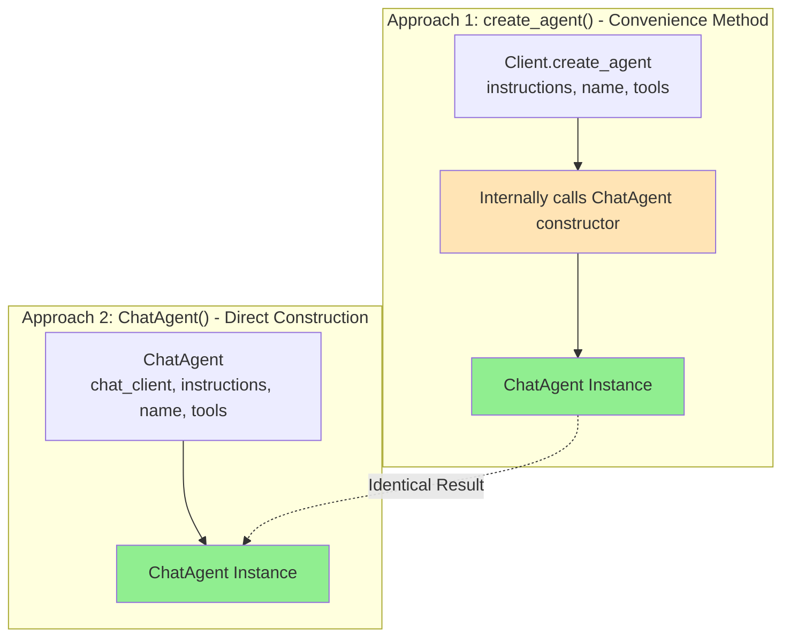

# ChatAgent vs create_agent() - Technical Comparison

**Date**: November 13, 2025 (Updated: January 6, 2026)  
**Status**: Validated against Microsoft Docs & Agent Framework source code  
**Team Question**: What are the differences between the two approaches to create agents?

---

## Supported Agent Types in Microsoft Agent Framework

Microsoft Agent Framework supports multiple agent types with different chat history storage capabilities:

| Agent Type | Underlying Service | Service Chat History | Custom Chat History |
|------------|-------------------|---------------------|---------------------|
| **Azure AI Agent** | Azure AI Agents Service | ✅ Yes | ❌ No |
| **Azure OpenAI Chat Completion** | Azure OpenAI Chat Completion | ❌ No | ✅ Yes |
| **Azure OpenAI Responses** | Azure OpenAI Responses | ✅ Yes | ✅ Yes |


## So the Complete Picture Is:

NOTE: Azure AI Agents are sometimes referred to as Azure AI Foundry Agents (same thing).

| Summary Name (table) | Detailed Doc Page | Client Classes | Environment Variables |
|---------------------|-------------------|----------------|---------------------|
| **Azure AI Agent** | [Azure AI Foundry Agents](https://learn.microsoft.com/en-us/agent-framework/user-guide/agents/agent-types/azure-ai-foundry-agent) | `AzureAIAgentClient` or `AzureAIClient` | `AZURE_AI_PROJECT_ENDPOINT`<br/>`AZURE_AI_MODEL_DEPLOYMENT_NAME` |
| **Azure OpenAI Chat Completion** | [Azure OpenAI Chat Completion](https://learn.microsoft.com/en-us/agent-framework/user-guide/agents/agent-types/azure-ai-foundry-models-chat-completion-agent) | `AzureOpenAIChatClient` | `AZURE_OPENAI_ENDPOINT`<br/>`AZURE_OPENAI_DEPLOYMENT_NAME` |
| **Azure OpenAI Responses** | [Azure OpenAI Responses](https://learn.microsoft.com/en-us/agent-framework/user-guide/agents/agent-types/azure-ai-foundry-models-responses-agent) | `AzureOpenAIResponsesClient` | `AZURE_OPENAI_ENDPOINT`<br/>`AZURE_OPENAI_DEPLOYMENT_NAME` |


### Key Differences

**Azure AI Agent (`AzureAIAgentClient`)**
- Uses the Azure AI Agents Service backend
- Service-managed chat history (threads stored server-side)
- Cannot use custom chat history storage
- Best for: Production scenarios requiring hosted agent infrastructure

**Azure OpenAI Chat Completion (`AzureOpenAIChatClient`)**
- Uses Azure OpenAI Chat Completion API
- Client-managed chat history only (you must implement storage)
- No service-side history management
- Best for: Custom storage requirements, full control over conversation state

**Azure OpenAI Responses**
- Uses Azure OpenAI Responses API
- **Both** service-managed AND custom chat history supported
- Most flexible option
- Best for: Scenarios requiring both convenience and customization

> **Source**: [Microsoft Learn - Agent Types](https://learn.microsoft.com/en-us/agent-framework/user-guide/agents/agent-types/?pivots=programming-language-python) (Updated: November 10, 2025)

---

## Question

```python
## Approach 1
from agent_framework.azure import AzureOpenAIChatClient
chat_client = AzureOpenAIChatClient(credential=AzureCliCredential())
writer = chat_client.create_agent(
    instructions="hello",
    name="writer",
)

## Approach 2
from agent_framework import ChatAgent
writer = ChatAgent(instruction="hello", name='writer', chat_client=chat_client)
```

Are the behaviors exactly the same?

## Answer: Yes - Identical Behavior ✅

Both approaches create the **exact same agent** with **identical behavior**. Approach 1 (`create_agent()`) is a convenience method that internally calls Approach 2 (`ChatAgent()`).

## Architecture Overview

### Multi-Agent System Example

Below is an example of a complex multi-agent system architecture showing how agents interact through an orchestrator. This demonstrates the type of sophisticated systems you can build using Microsoft Agent Framework, regardless of whether you use `ChatAgent()` or `create_agent()` - both approaches support the same capabilities.


*This diagram shows a production multi-agent system with specialized agents (Calendar, Timesheet, Suggestion, Approval, Revenue) coordinated by an orchestrator, with conversation threading, data persistence, and audit logging.*

### Agent Creation Flow



**Key Point**: `create_agent()` is syntactic sugar that constructs `ChatAgent` internally. Both produce identical `ChatAgent` instances with the same capabilities.

## Technical Details

### What `create_agent()` Does

From `agent_framework/_clients.py` (line 715):

```python
def create_agent(
    self,
    *,
    id: str | None = None,
    name: str | None = None,
    instructions: str | None = None,
    # ... all ChatAgent parameters ...
) -> "ChatAgent":
    """Create a ChatAgent with this client.
    
    This is a convenience method that creates a ChatAgent instance with this
    chat client already configured.
    """
    # Returns a ChatAgent instance with self as the chat_client
    return ChatAgent(
        chat_client=self,  # Passes itself as the chat_client
        id=id,
        name=name,
        instructions=instructions,
        # ... forwards all other parameters ...
    )
```

**Key Point**: `create_agent()` is literally just syntactic sugar that constructs a `ChatAgent` with the client passed as `chat_client=self`.

### Equivalent Code

These are **functionally identical**:

```python
# Approach 1: Convenience method
agent = client.create_agent(name="writer", instructions="hello")

# Approach 2: Direct construction (what Approach 1 does internally)
agent = ChatAgent(chat_client=client, name="writer", instructions="hello")
```

## Microsoft Docs Validation

From [Microsoft Learn - Agent Types](https://learn.microsoft.com/en-us/agent-framework/user-guide/agents/agent-types/):

> "To create one of these agents, simply construct a `ChatAgent` using the chat client implementation of your choice."
>
> **"Alternatively, you can use the convenience method on the chat client"**

### Official Examples Show Both Patterns

**Direct ChatAgent Construction:**
```python
async with ChatAgent(
    chat_client=AzureAIAgentClient(async_credential=credential),
    instructions="You are a helpful assistant"
) as agent:
    response = await agent.run("Hello!")
```

**Convenience Method:**
```python
async with DefaultAzureCredential() as credential:
    agent = AzureAIAgentClient(async_credential=credential).create_agent(
        instructions="You are a helpful assistant"
    )
```

From [Create and Run an Agent Tutorial](https://learn.microsoft.com/en-us/agent-framework/tutorials/agents/run-agent):

```python
agent = AzureOpenAIChatClient(credential=AzureCliCredential()).create_agent(
    instructions="You are good at telling jokes.",
    name="Joker"
)
```

## When to Use Each Approach

### Use `client.create_agent()` (Recommended)

**Best for:**
- ✅ Tutorials and workshops
- ✅ Quick demos and prototypes
- ✅ Creating multiple agents from the same client
- ✅ Clean, readable code

**Example:**
```python
client = AzureOpenAIChatClient(credential=cred)
agent1 = client.create_agent(name="writer", instructions="...")
agent2 = client.create_agent(name="editor", instructions="...")
agent3 = client.create_agent(name="reviewer", instructions="...")
```

### Use `ChatAgent()` Directly

**Best for:**
- ✅ Explicit control and visibility
- ✅ Complex configurations with many parameters
- ✅ IDE autocomplete for all ChatAgent features
- ✅ When you want to see all available options

**Example:**
```python
agent = ChatAgent(
    chat_client=client,
    name="writer",
    instructions="hello",
    temperature=0.7,
    max_tokens=500,
    tools=[get_weather, search_web],
    middleware=[logging_middleware, tracing_middleware],
    context_providers=[memory_provider],
    response_format=PersonInfo,
)
```

## Code Sample Analysis

From Microsoft Learn documentation, both patterns appear **equally throughout**:

### Pattern Distribution
- **Getting Started Tutorials**: 90% use `create_agent()` (cleaner)
- **Advanced Configuration**: 60% use direct `ChatAgent()` (more explicit)
- **Production Samples**: Mix of both (developer preference)

### Official Tutorial Preference
Microsoft's official tutorials **consistently use** `create_agent()`:
- ✅ "Create and run an agent" tutorial
- ✅ "Using function tools" tutorial  
- ✅ "Agent as function tool" tutorial
- ✅ "Structured output" tutorial
- ✅ "Images with agents" tutorial

## Common Parameters

Both approaches support **identical parameters**:

| Parameter | Type | Description |
|-----------|------|-------------|
| `id` | `str \| None` | Unique identifier |
| `name` | `str \| None` | Agent name |
| `instructions` | `str \| None` | System instructions |
| `tools` | `ToolProtocol \| ...` | Function tools |
| `temperature` | `float \| None` | Sampling temperature |
| `max_tokens` | `int \| None` | Max response tokens |
| `model_id` | `str \| None` | Model override |
| `middleware` | `Middleware \| list` | Interceptors |
| `context_providers` | `ContextProvider \| list` | Context injection |
| `response_format` | `type[BaseModel]` | Structured output |
| `chat_message_store_factory` | `Callable` | History persistence |

## Workshop Recommendation

**For Microsoft Agent Framework workshops, use `create_agent()`**:

```python
# ✅ Recommended for workshops
from agent_framework.azure import AzureOpenAIChatClient
from azure.identity import AzureCliCredential

agent = AzureOpenAIChatClient(credential=AzureCliCredential()).create_agent(
    name="assistant",
    instructions="You are a helpful assistant."
)
```

**Why:**
- Matches official Microsoft tutorials
- More concise and easier to read
- Shows client-agent relationship clearly
- Easier for beginners to understand

## Summary

| Aspect | Result |
|--------|--------|
| **Behavior** | ✅ Identical |
| **Return Type** | ✅ Both return `ChatAgent` |
| **Parameters** | ✅ Same parameters |
| **Performance** | ✅ No difference |
| **Validation** | ✅ Confirmed by MS Docs |
| **Recommendation** | ✅ Use `create_agent()` for workshops |

Both approaches are **fully supported** and **functionally equivalent**. The choice is purely stylistic based on your use case and preference.

## References

- [Microsoft Learn - Agent Types](https://learn.microsoft.com/en-us/agent-framework/user-guide/agents/agent-types/)
- [Microsoft Learn - Create and Run Agent](https://learn.microsoft.com/en-us/agent-framework/tutorials/agents/run-agent)
- [Microsoft Learn - Agent with Function Tools](https://learn.microsoft.com/en-us/agent-framework/tutorials/agents/function-tools)
- Agent Framework Source: `python/packages/core/agent_framework/_clients.py` (line 715)
- Agent Framework Source: `python/packages/core/agent_framework/_agents.py` (line 513)

---

**Validated**: November 13, 2025  
**Sources**: Microsoft Agent Framework GitHub repo + Microsoft Learn documentation
