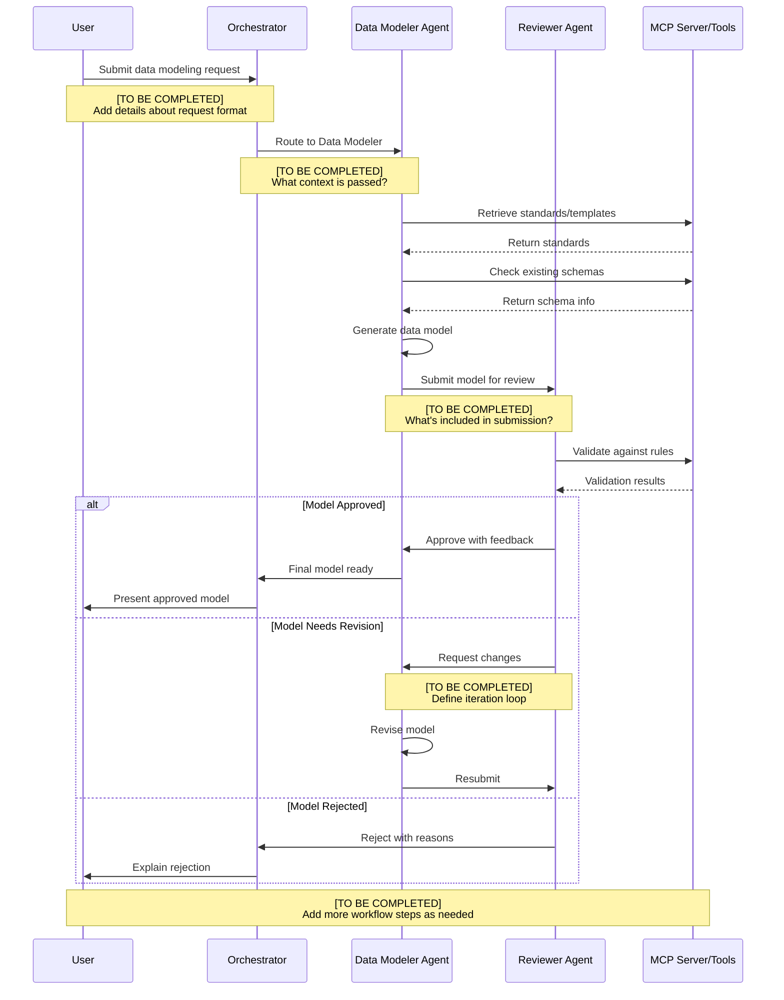
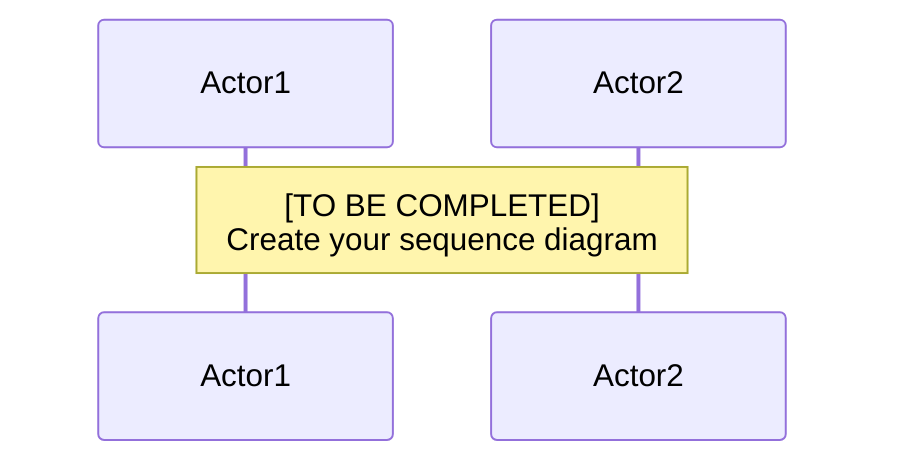

# PROFISEE Multi-Agent System Design Document

---

## About This Template

### Purpose
This design document template was created to support PROFISEE's migration from Semantic Kernel to Microsoft Agent Framework and the design of their multi-agent Master Data Management (MDM) system. It provides a structured approach to documenting agent personas, workflows, tools, and architecture decisions prior to the Architecture Design Session (ADS) in late January 2026.

### Context & Background
This template was developed following the **December 19, 2025 meeting** between Microsoft (Jason Virtue - PSA, Arturo Quiroga - CSA) and PROFISEE (Jack Gordon, Wes Heath, Eric Melcher, Jayla Ellis, and team) to establish a clear path forward for:
1. Migrating from Semantic Kernel to Agent Framework
2. Designing a scalable multi-agent architecture
3. Integrating MCP (Model Context Protocol) servers for tool management
4. Operating in "startup mode" for rapid prototyping in February 2026

The template incorporates real examples from **Jack Gordon's December 2025 demo** showing Data Modeler and Reviewer agents collaborating to build data models in Profisee MDM, including actual chat logs, tool interactions, and JSON response formats.

### Alignment with Jason Virtue's Game Plan (January 17, 2026)

This template directly addresses **Items 1-3** from Jason's follow-up email:

1. ✅ **Design document as a sequence diagram** - Complete template for agent personas and workflows with Mermaid diagrams
2. ✅ **List of Plug-ins and description of business logic** - Comprehensive tool inventory section with migration planning
3. ✅ **List of MCP Servers** - MCP Server Architecture section for documenting setup and integration

**Additional game plan items** supported by this document:
- **Item 4** (Setup meeting to review MCP servers): Template provides structure for documenting current MCP setup
- **Item 5** (ADS Session in late Jan): Document serves as preparation material for productive session
- **Item 6** (Rapid Prototyping): Design decisions documented here inform February prototyping work
- **Item 7** (Monthly MAF discussions): Provides baseline for tracking migration progress

### How to Use This Template

**For PROFISEE Team:**
1. **Review** sections already populated with examples from Jack's demo (Data Modeler, Reviewer agents)
2. **Complete** all sections marked `[TO BE COMPLETED]` with your specific implementation details
3. **Add** any additional agent personas beyond Data Modeler and Reviewer
4. **Document** all current Semantic Kernel plugins for migration planning
5. **Describe** your MCP server architecture and tool distribution strategy
6. **Review** with your team before sharing with Microsoft for ADS session

**Completion Checklist:**
- [ ] All agent personas documented with complete system prompts
- [ ] At least 2-3 key workflows documented with sequence diagrams
- [ ] Complete plugin/tool inventory (beyond the 3 examples provided)
- [ ] MCP server architecture and deployment documented
- [ ] Integration points and external systems identified
- [ ] Success criteria and KPIs defined
- [ ] Open questions listed for ADS session discussion

**Microsoft Team Contact:**
- Jason Virtue (PSA): Jason.Virtue@microsoft.com
- Arturo Quiroga (CSA): Arturo.Quiroga@microsoft.com
- Christian Thilmany (on Cc)

### Related Migration Resources
- [SK to AF Migration Guide (C#)](./PROFISEE-SK-TO-AF-MIGRATION-GUIDE-CSHARP.md)
- [IChatClient vs AIAgent Decision Guide](./PROFISEE-SK-TO-AF-ICHATCLIENT-VS-AIAGENT.md)
- [PROFISEE Specific Migration Guide](./PROFISEE-SPECIFIC-MIGRATION-GUIDE-2025-12-19.md)
- [Migration Addendum](./PROFISEE-SPECIFIC-MIGRATION-GUIDE-ADDENDUM-2025-12-19.md)
- [December 19, 2025 Meeting Recap](./recap_DEC_19_2005.md)

---

**Document Version:** 1.0  
**Date Created:** January 19, 2026  
**Status:** TEMPLATE - To be completed by PROFISEE team  
**Next Review:** ADS Session - Late January 2026

---

## Table of Contents
1. [Executive Summary](#executive-summary)
2. [Agent Personas](#agent-personas)
3. [Agent Workflows & Sequence Diagrams](#agent-workflows--sequence-diagrams)
4. [Plugin/Tool Inventory](#plugintool-inventory)
5. [MCP Server Architecture](#mcp-server-architecture)
6. [Data Flow & Integration Points](#data-flow--integration-points)
7. [Success Criteria & KPIs](#success-criteria--kpis)

---

## Executive Summary

### Business Context
**[TO BE COMPLETED BY PROFISEE]**
- What business problem are you solving with multi-agent architecture?
- What are the current pain points in your workflows?
- What are the expected business outcomes?

### Technical Context
- **Current State:** Semantic Kernel-based implementation
- **Target State:** Agent Framework multi-agent system with MCP server integration
- **Migration Timeline:** Migration readiness by May 2026
- **Prototyping Phase:** February 2026 (Startup Mode)

### High-Level Architecture Overview
**[TO BE COMPLETED BY PROFISEE]**
```
[Provide a high-level diagram or description of how agents interact]

Example:
User Request → Orchestrator Agent → Specialized Agents → MCP Tools → Results
```

---

## Agent Personas

> **Instructions:** For each agent persona in your system, complete the following template. Based on Dec 19 demo, you showed at least a Data Modeler and Reviewer agent. Add all relevant personas.

### Agent Persona Template

#### Agent #1: [Name]

**Role & Responsibility:**
- **[TO BE COMPLETED]** What is this agent's primary function?
- **[TO BE COMPLETED]** What domain expertise does it represent?

**Capabilities:**
- **[TO BE COMPLETED]** What can this agent do?
- **[TO BE COMPLETED]** What decisions can it make autonomously?
- **[TO BE COMPLETED]** What requires human approval?

**Tools/Plugins Required:**
- **[TO BE COMPLETED]** List specific tools this agent needs access to
- **[TO BE COMPLETED]** Which MCP servers does it interact with?

**Input Requirements:**
- **[TO BE COMPLETED]** What information does this agent need to operate?
- **[TO BE COMPLETED]** What context must be provided?

**Output/Deliverables:**
- **[TO BE COMPLETED]** What does this agent produce?
- **[TO BE COMPLETED]** In what format?

**Interaction Pattern:**
- **[TO BE COMPLETED]** Does this agent work independently or collaborate with others?
- **[TO BE COMPLETED]** Which other agents does it interact with?

**System Prompt (Initial Draft):**
```
[TO BE COMPLETED]
Define the persona, constraints, and behavioral guidelines for this agent.
```

---

#### Agent #2: Data Modeler Agent
> *(Based on Dec 19 demo and Jack Gordon's chat log example)*

**Role & Responsibility:**
- Creates and proposes data models in Profisee Master Data Management platform
- Understands data modeling best practices and MDM standards
- Translates business requirements into technical data structures (entities, attributes, relationships)
- Handles entity creation with proper naming conventions and prefixes

**Capabilities:**
- Analyze business requirements for data modeling needs (e.g., "grocery store model")
- Create entities with specified prefixes/naming conventions
- Define attributes with appropriate data types (Text, Number, Date, Domain-based)
- Set up domain-based attributes for foreign key relationships
- Configure attribute properties (unique, indexed, required, precision)
- Handle naming conflicts (e.g., reserved words) and propose alternatives
- Detect and skip duplicate entities
- Propose logical sequences for model building (entities → attributes → relationships)

**Tools/Plugins Required:**
Based on Jack's demo, these Profisee-specific tools are used:

1. **CreateEntity** - Creates new entities in Profisee
   - Returns: `{"is_success": bool, "entity_name": string, "error_message": array}`
   
2. **CreateAttribute** - Creates attributes for entities
   - Returns: `{"is_success": bool, "attribute_name": string, "error_messages": array}`
   - Handles various attribute types: Text, Number (with precision), Domain-based
   
3. **SearchEntities** - Checks for existing entities
   - Returns: `{"is_success": bool, "Names": array, "TotalEntities": int, "error_messages": array}`

4. **[TO BE COMPLETED]** Additional Profisee MDM tools
   - SetPrimaryIdentifier
   - CreateRelationship
   - ValidateDataModel
   - Other tools used in your current SK implementation

**Input Requirements:**
- Business requirements (natural language: "Create a data model for a grocery store")
- Naming conventions (prefixes like TEST, TEST2, etc.)
- Existing data model context (checked via SearchEntities)
- Organizational data standards
- **[TO BE COMPLETED]** Schema templates or patterns

**Output/Deliverables:**
- Created entities in Profisee with proper naming
- Entity attributes with correct data types and properties
- Domain-based relationships between entities
- Success/failure reports for each operation
- Proposals for next steps in model building
- Alternative approaches when conflicts arise (e.g., ProductName instead of Name)

**Interaction Pattern:**
- **Proposal-based collaboration:** Proposes entities and attributes, waits for Reviewer feedback
- **Proactive conflict resolution:** Detects issues (reserved words, duplicates) and suggests alternatives
- **Sequential building:** Creates entities first, then attributes, then relationships
- **Conversational checkpoints:** Asks "Shall we proceed?" at logical breakpoints
- **Example interaction flow:**
  1. Receives high-level request ("grocery store model")
  2. Proposes entity list
  3. Creates entities with progress updates
  4. Proposes attribute structure
  5. Creates attributes with validation
  6. Coordinates with Reviewer for next steps

**Example Interaction from Demo:**
```
User: "Create a data model for a grocery store, prefixing each entity with TEST"

DataModeler: "Here's a simple grocery store data model with TEST prefix:
- TEST_Product – Stores product details
- TEST_Category – Product categories
- TEST_Supplier – Supplier details
[...]
Do you want me to go ahead and create these entities in Profisee?"

[Creates entities, provides feedback]

DataModeler: {"is_success":true,"entity_name":"TEST_Product","error_message":null}

[Later detects conflict]

DataModeler: {"is_success":false,"attribute_name":null,"error_messages":["Attribute name Name is a reserved word."]}
DataModeler: "The attribute name Name is reserved. We should rename it to something like ProductName. Would you like me to proceed with that?"
```

**System Prompt (Initial Draft):**
```
You are an expert data modeler specializing in Profisee Master Data Management. 
Your role is to analyze business requirements and create optimal data models 
that follow MDM best practices and Profisee conventions.

Your Responsibilities:
- Create entities with proper naming conventions (respect prefixes like TEST_, TEST2)
- Define attributes with appropriate data types and properties
- Use domain-based attributes for relationships between entities
- Detect and handle conflicts (reserved words, duplicate entities)
- Propose logical sequences for model construction
- Collaborate with the DataModelReviewer agent for validation

Guidelines:
- Always check for existing entities before creating new ones
- Propose the full entity list before creating to get user confirmation
- Provide clear feedback after each operation (success/failure with details)
- When you encounter errors, explain them clearly and propose alternatives
- Use these attribute types in Profisee:
  * Text - for names, descriptions, codes
  * Number - for quantities, prices (specify decimal precision)
  * Date - for timestamps
  * Domain-based - for foreign keys (relationships to other entities)
- Set proper attribute properties:
  * Unique and indexed for primary identifiers
  * Required for mandatory fields
  * Decimal precision for numeric fields (e.g., Price = 2 decimals)
- Follow entity → attributes → relationships sequence
- Ask for confirmation at logical breakpoints
- Be conversational and explain your reasoning

Error Handling:
- If entity already exists: Skip and inform user
- If attribute name is reserved: Suggest alternative immediately
- If operation fails: Provide clear error message and next steps
- Always return structured JSON responses from tool calls

**[TO BE COMPLETED]** Add any Profisee-specific business rules or conventions
```

---

#### Agent #3: Data Model Reviewer Agent
> *(Based on Dec 19 demo and Jack Gordon's chat log example)*

**Role & Responsibility:**
- Reviews data models proposed by Data Modeler Agent
- Validates entities and attributes against standards
- Detects duplicate entities and validates creation success
- Provides structured recommendations for next steps in model building
- Acts as quality gate before finalizing model components

**Capabilities:**
- Verify entity creation success/failure
- Detect duplicate entities in Profisee
- Search for existing entities to avoid conflicts
- Validate attribute definitions (data types, properties, relationships)
- Recommend attribute structures for entities
- Propose logical next steps in model construction
- Validate naming conventions and best practices
- Review domain-based relationships for correctness
- Can approve patterns automatically or flag issues

**Tools/Plugins Required:**
Based on Jack's demo, these Profisee-specific tools are used:

1. **SearchEntities** - Validates existing entities
   - Returns: `{"is_success": bool, "Names": array, "TotalEntities": int, "error_messages": array}`
   
2. **CreateEntity** - Can also create entities (appears to have dual role)
   - Returns: `{"is_success": bool, "entity_name": string, "error_message": array}`

3. **CreateAttribute** - Can validate/create attributes
   - Returns: `{"is_success": bool, "attribute_name": string, "error_messages": array}`

4. **[TO BE COMPLETED]** Additional validation tools
   - ValidateRelationships
   - CheckNamingConventions
   - ValidateDataTypes
   - Other validation tools

**Input Requirements:**
- Proposed entity list from Data Modeler
- Entity creation results (success/failure JSON)
- Attribute proposals from Data Modeler
- Existing model context (from SearchEntities)
- **[TO BE COMPLETED]** Profisee standards and rules

**Output/Deliverables:**
- Validation results with success/failure indicators
- List of existing entities (to avoid duplicates)
- Recommended attribute structures with data types and properties
- Approval or modification requests
- Structured next steps for model completion
- Clear communication about what was created vs. what already exists

**Interaction Pattern:**
- **Validation-first approach:** Checks for existing entities before approving creation
- **Structured recommendations:** Provides detailed attribute specifications
- **Agenda-driven:** Clearly states "Next agenda step" or "Next steps"
- **Collaborative approval:** Confirms with Data Modeler before proceeding
- **Example interaction flow:**
  1. Receives entity creation results from Data Modeler
  2. Validates each entity (detects duplicates)
  3. Provides comprehensive status report
  4. Recommends next steps (attributes → relationships)
  5. Specifies exact attribute structure with data types
  6. Asks for confirmation to proceed
  7. Validates attribute creation results
  8. Proposes next entity to complete

**Example Interaction from Demo:**
```
DataModelReviewer: {"is_success":true,"entity_name":"TEST_Product","error_message":null}
[... validates multiple entities ...]

DataModelReviewer: "All TEST_ prefixed grocery store entities have been created successfully. 
> *(Based on Jack Gordon's actual demo: "Create a data model for a grocery store")*

**Business Scenario:**
A business user or data steward needs to create a new data model in Profisee MDM for a specific domain (e.g., grocery store, customer management, product catalog). The model includes entities, attributes, and relationships. The multi-agent system collaborates to design, create, and validate the model with minimal human intervention.

**Actors:**
- User/Business Analyst/Data Steward
- Data Modeler Agent (proposal and creation)
- Data Model Reviewer Agent (validation and guidance)
- Profisee MDM Platform (via MCP Server or direct API)
- **[TO BE COMPLETED]** Orchestrator Agent (if used for routing)

**Real Example from Demo:**
```
User: "Create a data model for a grocery store, prefixing each entity with TEST"

Result: Complete model with entities (Product, Category, Supplier, Customer, Order, OrderItem, 
Inventory, Store) and fully defined attributes, all created through agent collaboration.
```

**Sequence Diagram:**

```mermaid
sequenceDiagram
    participant U as User
    participant DM as Data Modeler Agent
    participant R as Data Model Reviewer Agent
    participant P as Profisee MDM<br/>(via MCP/Tools)
    
    U->>DM: "Create grocery store model with TEST prefix"
    
    DM->>DM: Analyze requirements<br/>& propose entity list
    DM->>U: Present proposed entities<br/>(Product, Category, Supplier, etc.)
    
    U->>DM: Confirm creation
    
    loop For Each Entity
        DM->>P: CreateEntity(entity_name)
        P-->>DM: {is_success: true/false, entity_name, error_message}
        DM->>U: Report creation status
        
        alt Entity Creation Failed (Duplicate)
            DM->>P: SearchEntities(prefix)
            P-->>DM: {Names: [...], TotalEntities: N}
            DM->>U: "Entity exists, shall we skip?"
        end
    end
    
    DM->>R: All entities created/validated
    
    R->>P: SearchEntities() to validate
    P-->>R: Complete entity list
    
    R->>R: Analyze entity structure<br/>& plan attributes
    R->>U: Propose attribute structure<br/>with data types & properties
    
    U->>R: Approve attribute creation
    
    loop For Each Entity
        R->>DM: "Create attributes for [Entity]:<br/>- Attribute1 (Type, Properties)<br/>- Attribute2 (Domain-based)..."
        
     User provides natural language request: "Create a data model for [domain] with [prefix]"
   - Required information: Domain description (e.g., "grocery store"), entity prefix (e.g., "TEST")
   - Optional: Specific entity names, attributes, or relationships
   - Request is conversational - no formal structure required
   - **[TO BE COMPLETED]** Is there an orchestrator that routes, or direct agent activation?

2. **Entity Proposal & Creation** *(Data Modeler Agent)*
   - Data Modeler analyzes requirements and proposes entity list
   - Presents entities to user with descriptions (e.g., "TEST_Product – Stores product details")
   - Waits for user confirmation
   - Iterates through entities calling `CreateEntity()` tool
   - Reports creation status after each entity with JSON responses
   - Detects duplicates and proposes to skip existing entities
   - **Observed behavior:** Creates entities sequentially, reporting each success/failure

3. **Entity Validation** *(Reviewer Agent)*
   - Reviewer calls `SearchEntities()` to validate what was created
   - Compares proposed vs. actual entities
   - Reports comprehensive status (what exists, what was created, what failed)
   - Detects and flags duplicate entities
   - Proposes next logical step: attribute definition

4. **Attribute Structure Proposal** *(Reviewer Agent)*
   - Reviewer recommends complete attribute structure for each entity
   - Specifies for each attribute:
     * Name
     * Data type (Text, Number with precision, Date, Domain-based)
     * Properties (unique, indexed, required)
     * Relationships (domain links to other entities)
   - Example: "ProductID – Unique text (primary identifier, indexed)"
   - Asks for confirmation before proceeding

5. **Attribute Creation** *(Data Modeler & Reviewer collaboration)*
   - Data Modeler calls `CreateAttribute()` for each attribute
   - Reports success/failure with JSON responses
   - Handles errors immediately:
     * Reserved word → Proposes alternative (Name → ProductName)
     * Duplicate → Skips and continues
   - Reviewer validates successful creation
   - Agents collaborate to determine next entity
   - Process repeats for all entities
   - **Observed behavior:** Agents checkpoint with user: "Shall we proceed?"

6. **Relationship Definition** *(Next phase)*
   - After all entities and attributes are created
   - Domain-based attributes are used for foreign key relationships
   - **[TO BE COMPLETED]** Are relationships created automatically via domain attributes, or separate step?
   - **[TO BE COMPLETED]** Are there explicit relationship creation tools?

7. **Completion & Validation**
   - Reviewer provides final summary of created entities and attributes
   - Proposes any additional steps (indexes, constraints, validation rules)
   - Model is now available in Profisee MDM
   - **[TO BE COMPLETED]** Is there a final validation or approval step?
   - **[TO BE COMPLETED]** Where is the model persisted? (Already in Profisee)

**Error Handling (Observed from Demo):**

- **Reserved Word Error:** 
  - Error: `{"is_success":false,"attribute_name":null,"error_messages":["Attribute name Name is a reserved word."]}`
  - Resolution: Data Modeler immediately proposes alternative (ProductName) and asks for approval
  
- **Duplicate Entity:**
  - Error: `{"is_success":false,"entity_name":null,"error_message":["Entity TEST_Product must be unique"]}`
  - Resolution: Agent calls SearchEntities() to validate existing entities, proposes to skip
  
- **Creation Failure:**
  - Each tool call returns structured JSON with is_success flag
  - Agents report failures to user and propose corrective action
  - No automatic retry - agents ask user for guidance
  
- **[TO BE COMPLETED]** What happens if Profisee API is unavailable?
- **[TO BE COMPLETED]** Are there retry limits for transient failures?
- **[TO BE COMPLETED]** Escalation to human if agents can't proceed?

**Performance Expectations:**

- **Entity CreCreateEntity
> *(Observed in Jack Gordon's demo)*

**Current Implementation:**
- **Framework:** Semantic Kernel (to be migrated to Agent Framework)
- **Location:** **[TO BE COMPLETED]** Current SK plugin location
- **Status:** Production (actively used in demo)

**Business Purpose:**
Creates new entities (master data tables) in Profisee MDM platform. Enables dynamic data model construction without manual configuration in the Profisee UI.

**Technical Description:**
Makes API call to Profisee to create a new entity with specified name. Validates entity name uniqueness and applies naming conventions. Returns structured success/failure response.

**Input Parameters:**
```json
{
  "entity_name": "Name of the entity to create (e.g., 'TEST_Product', 'TEST2 Categories')",
  "description": "Optional description of entity purpose [TO BE COMPLETED]",
  "entity_type": "Type of entity [TO BE COMPLETED - Standard/Hierarchy/etc.]"
}
```

**Output Format:**
```json
{
  "is_success": true,
  "entity_name": "TEST_Product",
  "error_message": null
}

// Or on failure:
{
  "is_success": false,
  "entity_name": null,
  "error_message": ["Entity TEST_Product must be unique"]
}
```

**Dependencies:**
- Profisee MDM REST API
- **[TO BE COMPLETED]** Authentication (API key, OAuth, Entra ID?)
- **[TO BE COMPLETED]** Profisee connection configuration
- Valid Profisee environment/model context

**Agent Consumers:**
- Data Modeler Agent (primary creator)
- Data Model Reviewer Agent (also creates entities in demo - verify dual role)

**Business Logic:**
- Validates entity name doesn't already exist
- Applies entity naming rules/conventions
- Creates entity in Profisee data model
- **[TO BE COMPLETED]** Does it set default properties (permissions, versioning)?
- **[TO BE COMPLETED]** Are there entity templates applied?

**Migration Plan:**
- **Target Location:** MCP Server (based on Dec 19 discussion about MCP hosting tools)
- **Effort Estimate:** Small - straightforward API wrapper
- **Migration Priority:** High - Core functionality for data modeling workflow
- **Migration Notes:** 
  - Convert from SK plugin to Agent Framework function
  - Register with AIFunctionFactory
  - May move to MCP server for centralized tool management
  - Ensure JSON response format is preserved for agents

**Performance Characteristics:**
- **Average Execution Time:** ~1-2 seconds (observed in demo)
- **Resource Requirements:** Minimal - single API call
- **Rate Limits:** **[TO BE COMPLETED]** Profisee API rate limits?

---

#### Tool #2: CreateAttribute
> *(Observed in Jack Gordon's demo)*

**Current Implementation:**
- **Framework:** Semantic Kernel (to be migrated to Agent Framework)
- **Location:** **[TO BE COMPLETED]** Current SK plugin location
- **Status:** Production (actively used in demo)

**Business Purpose:**
Creates attributes (columns/fields) for entities in Profisee MDM. Supports various data types, properties, and domain-based relationships. Core tool for defining entity structure.

**Technical Description:**
Makes API call to Profisee to create a new attribute on a specified entity. Handles different data types (Text, Number, Date, Domain-based). Configures attribute properties (unique, indexed, required, precision). Returns structured success/failure response.

**Input Parameters:**
```json
{
  "entity_name": "Entity to add attribute to (e.g., 'TEST_Product')",
  "attribute_name": "Name of attribute (e.g., 'ProductName', 'Price')",
  "data_type": "Text | Number | Date | Domain",
  "properties": {
    "is_unique": false,
    "is_indexed": false,
    "is_required": false,
    "precision": 0,
    "domain_entity": "Entity name if Domain type (e.g., 'TEST_Category')"
  },
  "description": "Optional attribute description [TO BE COMPLETED]"
}
```

**Output Format:**
```json
{
  "is_success": true,
  "attribute_name": "ProductName",
  "error_messages": []
}

// Or on failure:
{
  "is_success": false,
  "attribute_name": null,
  "error_messages": ["Attribute name Name is a reserved word."]
}
```

**Dependencies:**
- Profisee MDM REST API
- Target entity must exist
- For Domain type: Domain entity must exist
- **[TO BE COMPLETED]** Authentication
- **[TO BE COMPLETED]** Profisee connection configuration

**Agent Consumers:**
- Data Modeler Agent (primary creator)

**Business Logic:**
- Validates attribute name against reserved words
- Validates entity exists
- For Domain-based: Validates domain entity exists (foreign key relationship)
- Sets appropriate data type and precision
- Configures attribute properties (unique, indexed, required)
- **[TO BE COMPLETED]** Does it create indexes automatically?
- **[TO BE COMPLETED]** Default values handling?

**Migration Plan:**
- **Target Location:** MCP Server
- **Effort Estimate:** Small-Medium - handles multiple data types and properties
- **Migration Priority:** High - Core functionality
- **Migration Notes:**
  - More complex than CreateEntity due to multiple data types
  - Preserve validation for reserved words
  - Ensure domain-based relationship logic is retained
  - Consider parameter validation before API call

**Performance Characteristics:**
- **Average Execution Time:** ~1-2 seconds per attribute
- **Resource Requirements:** Minimal - single API call
- **Rate Limits:** **[TO BE COMPLETED]** Profisee API rate limits?

---

#### Tool #3: SearchEntities
> *(Observed in Jack Gordon's demo)*

**Current Implementation:**
- **Framework:** Semantic Kernel (to be migrated to Agent Framework)
- **Location:** **[TO BE COMPLETED]** Current SK plugin location  
- **Status:** Production (actively used in demo)

**Business Purpose:**
Searches for and lists existing entities in Profisee MDM. Used for validation, duplicate detection, and context gathering before creating new entities.

**Technical Description:**
Queries Profisee for entities matching search criteria (e.g., prefix, name pattern). Returns list of entity names and count. Critical for agents to understand existing model structure.

**Input Parameters:**
```json
{
  "search_text": "Optional text to search for (e.g., 'TEST2' prefix) - null for all entities",
  "filter": {
    "prefix": "Filter by prefix [TO BE COMPLETED]",
    "entity_type": "Filter by type [TO BE COMPLETED]"
  }
}
```

**Output Format:**
```json
{
  "is_success": true,
  "search_text": null,
  "Names": ["TEST2 Categories", "TEST2 Customers", "TEST2 Orders", "TEST2 Products", "TEST2 Suppliers"],
  "TotalEntities": 5,
  "error_messages": []
}
```

**Dependencies:**
- Profisee MDM REST API
- **[TO BE COMPLETED]** Authentication
- **[TO BE COMPLETED]** Read permissions on entities

**Agent Consumers:**
- Data Model Reviewer Agent (primary - validates what exists)
- Data Modeler Agent (checks before creating)

**Business Logic:**
- Searches entities by name/prefix pattern
- Returns complete list of matching entities
- **[TO BE COMPLETED]** Does it return entity metadata (attributes, relationships)?
- **[TO BE COMPLETED]** Pagination for large result sets?

**Migration Plan:**
- **Target Location:** MCP Server
- **Effort Estimate:** Small - read-only query
- **Migration Priority:** High - Critical for validation workflow
- **Migration Notes:**
  - Simple API call, straightforward migration
  - Consider caching if called frequently
  - May want to enhance with metadata retrieval

**Performance Characteristics:**
- **Average Execution Time:** ~1-2 seconds
- **Resource Requirements:** Minimal - read query
- **Rate Limits:** **[TO BE COMPLETED]** Profisee API rate limits?

---

#### Tool #4: [Additional Profisee Tools]

**[TO BE COMPLETED]** Document additional tools based on your current SK implementation:
- GetEntity (retrieve entity details)
- UpdateEntity (modify existing entity)
- DeleteEntity (remove entity)
- CreateRelationship (explicit relationship creation if separate from domain attributes)
- ValidateDataModel (comprehensive validation)
- GetEntityAttributes (list attributes for entity)
- SetPrimaryIdentifier (configure primary key)
- CreateIndex (add indexes)
- **[Add all other tools your team uses
**Tools/Plugins Required:**
- **[TO BE COMPLETED]**

**Input Requirements:**
- **[TO BE COMPLETED]**

**Output/Deliverables:**
- **[TO BE COMPLETED]**

**Interaction Pattern:**
- **[TO BE COMPLETED]**

**System Prompt (Initial Draft):**
```
[TO BE COMPLETED]
```

---

#### [Add More Agent Personas As Needed]

---

## Agent Workflows & Sequence Diagrams

> **Instructions:** Document the key workflows in your system using sequence diagrams. Start with the primary use case demonstrated on Dec 19.

### Workflow #1: Data Model Creation and Review

**Business Scenario:**
**[TO BE COMPLETED]** Describe the business scenario this workflow addresses

**Actors:**
- User/Business Analyst
- Orchestrator Agent (if applicable)
- Data Modeler Agent
- Reviewer Agent
- **[TO BE COMPLETED]** Add other actors

**Sequence Diagram:**



**Workflow Steps (Detailed):**

1. **Request Initiation**
   - **[TO BE COMPLETED]** How does user submit request?
   - **[TO BE COMPLETED]** What information is required?
   - **[TO BE COMPLETED]** How is the request validated?

2. **Orchestration & Routing**
   - **[TO BE COMPLETED]** How does orchestrator determine which agents to invoke?
   - **[TO BE COMPLETED]** What's the routing logic?

3. **Data Model Generation**
   - **[TO BE COMPLETED]** What tools/plugins does Data Modeler use?
   - **[TO BE COMPLETED]** What's the generation process?
   - **[TO BE COMPLETED]** How are standards applied?

4. **Review Process**
   - **[TO BE COMPLETED]** What are the review criteria?
   - **[TO BE COMPLETED]** Automatic vs. manual review triggers?
   - **[TO BE COMPLETED]** Iteration limits?

5. **Completion & Handoff**
   - **[TO BE COMPLETED]** What happens after approval?
   - **[TO BE COMPLETED]** Where is the model stored?
   - **[TO BE COMPLETED]** What notifications are sent?

**Error Handling:**
- **[TO BE COMPLETED]** What happens if an agent fails?
- **[TO BE COMPLETED]** Retry logic?
- **[TO BE COMPLETED]** Escalation paths?

**Performance Expectations:**
- **[TO BE COMPLETED]** Expected completion time?
- **[TO BE COMPLETED]** Token/cost budget per workflow?

---

### Workflow #2: [Name of Second Key Workflow]

**Business Scenario:**
**[TO BE COMPLETED]**

**Actors:**
**[TO BE COMPLETED]**

**Sequence Diagram:**


**Workflow Steps (Detailed):**
**[TO BE COMPLETED]**

---

### Workflow #3: [Add More Workflows As Needed]

---

## Plugin/Tool Inventory

> **Instructions:** Document all plugins and tools used in your system. This is critical for the migration and for understanding MCP server requirements.

### Tool Classification

**1. Current Semantic Kernel Plugins:**
- **[TO BE COMPLETED]** List all current SK plugins that need migration

**2. New Tools for Agent Framework:**
- **[TO BE COMPLETED]** List new tools to be developed

**3. MCP-Hosted Tools:**
- **[TO BE COMPLETED]** List tools that will be hosted in MCP servers

### Tool Inventory Template

#### Tool #1: [Tool Name]

**Current Implementation:**
- **Framework:** Semantic Kernel / Native / MCP Server / **[TO BE COMPLETED]**
- **Location:** **[TO BE COMPLETED]** Path or MCP server name
- **Status:** Production / Development / Planning / **[TO BE COMPLETED]**

**Business Purpose:**
**[TO BE COMPLETED]** What business problem does this tool solve?

**Technical Description:**
**[TO BE COMPLETED]** What does this tool do technically?

**Input Parameters:**
```json
{
  "param1": "description [TO BE COMPLETED]",
  "param2": "description [TO BE COMPLETED]"
}
```

**Output Format:**
```json
{
  "result": "description [TO BE COMPLETED]"
}
```

**Dependencies:**
- **[TO BE COMPLETED]** External APIs
- **[TO BE COMPLETED]** Database connections
- **[TO BE COMPLETED]** Other tools
- **[TO BE COMPLETED]** Authentication requirements

**Agent Consumers:**
- **[TO BE COMPLETED]** Which agents use this tool?

**Business Logic:**
**[TO BE COMPLETED]** Describe the business logic implemented in this tool

**Migration Plan:**
- **Target Location:** MCP Server / Agent Framework Function / **[TO BE COMPLETED]**
- **Effort Estimate:** **[TO BE COMPLETED]** Small/Medium/Large
- **Migration Priority:** **[TO BE COMPLETED]** High/Medium/Low
- **Migration Notes:** **[TO BE COMPLETED]**

**Performance Characteristics:**
- **Average Execution Time:** **[TO BE COMPLETED]**
- **Resource Requirements:** **[TO BE COMPLETED]**
- **Rate Limits:** **[TO BE COMPLETED]**

---

#### Tool #2: [Tool Name]
**[TO BE COMPLETED - Use template above]**

---

#### [Add All Tools Using Template Above]

---

### Tool Categorization by Agent

**Data Modeler Agent Tools:**
1. **[TO BE COMPLETED]** Tool name and brief description
2. **[TO BE COMPLETED]**
3. **[TO BE COMPLETED]**

**Reviewer Agent Tools:**
1. **[TO BE COMPLETED]** Tool name and brief description
2. **[TO BE COMPLETED]**
3. **[TO BE COMPLETED]**

**[Other Agent] Tools:**
1. **[TO BE COMPLETED]**

---

### Tool Relationship Matrix

**[TO BE COMPLETED]** Create a matrix showing which agents use which tools

| Tool Name | Data Modeler | Reviewer | [Agent 3] | [Agent 4] |
|-----------|--------------|----------|-----------|-----------|
| Tool 1    | ✓            |          |           |           |
| Tool 2    | ✓            | ✓        |           |           |
| Tool 3    |              | ✓        |           |           |
| [...]     |              |          |           |           |

---

## MCP Server Architecture

> **Instructions:** Based on Dec 19 discussion about MCP server integration and tool management

### MCP Server Overview

**Purpose of MCP Servers in Your Architecture:**
**[TO BE COMPLETED]** Why are you using MCP servers?

**Current MCP Server Setup:**
- **[TO BE COMPLETED]** List current MCP servers
- **[TO BE COMPLETED]** What tools are hosted in each?

### MCP Server #1: [Name]

**Purpose:**
**[TO BE COMPLETED]** What does this MCP server provide?

**Hosted Tools:**
1. **[TO BE COMPLETED]** Tool name
2. **[TO BE COMPLETED]** Tool name
3. **[TO BE COMPLETED]** Tool name

**API Endpoints:**
**[TO BE COMPLETED]** List key endpoints

**Authentication/Security:**
**[TO BE COMPLETED]** How is access controlled?

**Dependencies:**
**[TO BE COMPLETED]** What external systems does this connect to?

**Deployment:**
- **Environment:** **[TO BE COMPLETED]** Dev/Staging/Prod
- **Infrastructure:** **[TO BE COMPLETED]** Azure/On-prem/Hybrid
- **Scaling:** **[TO BE COMPLETED]** How does it scale?

---

### [Add More MCP Servers]

---

### MCP Integration Patterns

**Connection Management:**
**[TO BE COMPLETED]** How do agents connect to MCP servers?

**Error Handling:**
**[TO BE COMPLETED]** What happens when MCP server is unavailable?

**Caching Strategy:**
**[TO BE COMPLETED]** Are results cached? For how long?

**Monitoring & Logging:**
**[TO BE COMPLETED]** How are MCP servers monitored?

---

## Data Flow & Integration Points

### System Context Diagram

**[TO BE COMPLETED]** Create a diagram showing:
- External systems
- Agents
- MCP servers
- Data stores
- User interfaces

```
[Add diagram or description]
```

### External System Integrations

#### Integration #1: [System Name]

**Purpose:**
**[TO BE COMPLETED]** Why does your agent system integrate with this?

**Integration Type:**
- [ ] REST API
- [ ] Database connection
- [ ] Message queue
- [ ] File transfer
- [ ] Other: **[TO BE COMPLETED]**

**Authentication Method:**
**[TO BE COMPLETED]**

**Data Exchanged:**
- **Inbound:** **[TO BE COMPLETED]**
- **Outbound:** **[TO BE COMPLETED]**

**Frequency:**
**[TO BE COMPLETED]** Real-time / Batch / On-demand

**Error Handling:**
**[TO BE COMPLETED]** What happens if integration fails?

---

### [Add More Integrations]

---

### Data Persistence

**What data needs to be persisted?**
- **[TO BE COMPLETED]** Agent conversation history
- **[TO BE COMPLETED]** Generated artifacts (models, documents)
- **[TO BE COMPLETED]** User preferences
- **[TO BE COMPLETED]** Audit logs
- **[TO BE COMPLETED]** Other

**Storage Solutions:**
**[TO BE COMPLETED]** Database, blob storage, etc.

**Data Retention Policies:**
**[TO BE COMPLETED]** How long is data kept?

---

## Success Criteria & KPIs

### Migration Success Criteria

**Technical Success Metrics:**
- [ ] All agents successfully migrated to Agent Framework
- [ ] All plugins converted and functional
- [ ] Performance benchmarks met or exceeded
- [ ] **[TO BE COMPLETED]** Add more criteria

**Business Success Metrics:**
- **[TO BE COMPLETED]** What business metrics will improve?
- **[TO BE COMPLETED]** Expected efficiency gains?
- **[TO BE COMPLETED]** User satisfaction improvements?

### Runtime KPIs

**Performance KPIs:**
- **Average Workflow Completion Time:** **[TO BE COMPLETED]** Target
- **Agent Response Time:** **[TO BE COMPLETED]** Target (e.g., < 3 seconds)
- **Token Efficiency:** **[TO BE COMPLETED]** Target tokens per workflow
- **Cost per Workflow:** **[TO BE COMPLETED]** Target cost

**Quality KPIs:**
- **Agent Accuracy Rate:** **[TO BE COMPLETED]** Target (e.g., 95%)
- **First-Time Success Rate:** **[TO BE COMPLETED]** Target
- **Human Intervention Rate:** **[TO BE COMPLETED]** Target (lower is better)
- **User Satisfaction Score:** **[TO BE COMPLETED]** Target

**Reliability KPIs:**
- **System Uptime:** **[TO BE COMPLETED]** Target (e.g., 99.9%)
- **Error Rate:** **[TO BE COMPLETED]** Target (e.g., < 1%)
- **Mean Time to Recovery:** **[TO BE COMPLETED]** Target

### Monitoring & Observability

**What will you monitor?**
- **[TO BE COMPLETED]** Agent performance metrics
- **[TO BE COMPLETED]** Tool execution times
- **[TO BE COMPLETED]** Error rates and types
- **[TO BE COMPLETED]** User interactions
- **[TO BE COMPLETED]** Cost and token usage

**Alerting Thresholds:**
**[TO BE COMPLETED]** What triggers alerts?

---

## Appendix

### Glossary
- **Agent Framework:** **[TO BE COMPLETED]** Define for your team
- **MCP Server:** **[TO BE COMPLETED]** Define for your team
- **[Add domain-specific terms]:** **[TO BE COMPLETED]**

### References
- [PROFISEE SK to AF Migration Guide](./PROFISEE-SK-TO-AF-MIGRATION-GUIDE-CSHARP.md)
- [IChatClient vs AIAgent Decision Guide](./PROFISEE-SK-TO-AF-ICHATCLIENT-VS-AIAGENT.md)
- [PROFISEE Specific Migration Guide](./PROFISEE-SPECIFIC-MIGRATION-GUIDE-2025-12-19.md)
- [PROFISEE Migration Addendum](./PROFISEE-SPECIFIC-MIGRATION-GUIDE-ADDENDUM-2025-12-19.md)

### Open Questions
**[TO BE COMPLETED]** Document any open questions or decisions that need to be made:

1. **[TO BE COMPLETED]** Question about agent interaction patterns?
2. **[TO BE COMPLETED]** Decision needed on tool placement (agent vs. MCP)?
3. **[TO BE COMPLETED]** Performance requirements unclear?
4. **[TO BE COMPLETED]** Add more questions

---

## Document Control

**Reviewers:**
- [ ] Jason Virtua (Microsoft PSA)
- [ ] Arturo Quiroga (Microsoft CSA)
- [ ] **[TO BE COMPLETED]** PROFISEE technical lead
- [ ] **[TO BE COMPLETED]** PROFISEE architect
- [ ] **[TO BE COMPLETED]** Other reviewers

**Change Log:**
| Date | Version | Author | Changes |
|------|---------|--------|---------|
| 2026-01-19 | 1.0 | Arturo Quiroga | Initial template created |
| | | | |

**Next Review Date:** ADS Session - Late January 2026

---

## Completion Checklist

Before ADS Session, ensure:
- [ ] All agent personas documented with system prompts
- [ ] At least 2-3 key workflows documented with sequence diagrams
- [ ] Complete plugin/tool inventory with business logic descriptions
- [ ] MCP server architecture documented
- [ ] Integration points identified
- [ ] Success criteria and KPIs defined
- [ ] Open questions listed for discussion
- [ ] Document reviewed by technical team

---

*This template was created to support the PROFISEE team's migration from Semantic Kernel to Agent Framework and the design of their multi-agent system. Complete all sections marked [TO BE COMPLETED] before the ADS session.*
