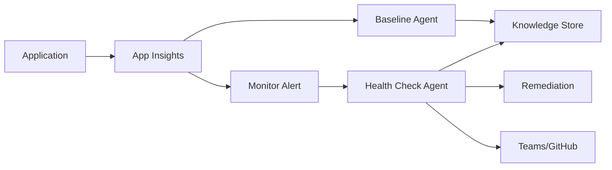
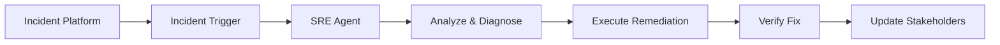

# SRE Agent - Reference Guide for Zafin Engagement

**Date:** January 20, 2026  
**Status:** Active Engagement  
**PSA:** Arturo Quiroga

---

## Executive Summary

Zafin is adopting **Azure SRE Agent** and requires support with **observability** and **agent best practices**. This document provides a comprehensive reference for the engagement, including architecture patterns, capabilities, and integration points.

---

## What is an SRE Agent?

An **SRE (Site Reliability Engineering) Agent** is an AI-powered autonomous agent designed to handle site reliability engineering tasks. It represents a shift from reactive to proactive operations management.

### Core Functions

| Function | Description |
|----------|-------------|
| **Monitoring & Observability** | Track system health, performance metrics, uptime, and analyze logs/traces |
| **Incident Response** | Detect, diagnose, and remediate production incidents autonomously |
| **Automation** | Automate repetitive operational tasks, self-healing, deployment automation |
| **Performance Optimization** | Analyze resource utilization, recommend scaling, identify bottlenecks |
| **Best Practices Enforcement** | Ensure compliance with reliability standards, generate runbooks |

---

## Microsoft Azure SRE Agent

Microsoft has published an official SRE Agent implementation and experimentation repository:

**Repository:** https://github.com/microsoft/sre-agent

### Key Capabilities

#### 1. **Autonomous Operations**
- **Proactive Baseline Learning** - Learns normal behavior patterns and stores them in knowledge base
- **Real-time Anomaly Detection** - Compares current metrics against learned baselines
- **Autonomous Remediation** - Executes Azure CLI commands to fix issues (e.g., slot swaps, restarts, scaling)
- **Review vs. Autonomous Modes** - Configurable agent autonomy levels

#### 2. **Sub-Agent Architecture**
Specialized agents for different operational domains:

| Sub-Agent Type | Purpose | Example Tools |
|----------------|---------|---------------|
| **Baseline Agents** | Capture and store performance baselines | QueryAppInsights, UploadKnowledgeDocument |
| **Health Check Agents** | Detect degradation and execute remediation | SearchMemory, Azure CLI, QueryAppInsights |
| **Reporter Agents** | Generate operational summaries and reports | GetTeamsMessages, SendOutlookEmail |

#### 3. **Trigger Types**

| Trigger | Description | Use Case |
|---------|-------------|----------|
| **Incident Triggers** | Respond to alerts from monitoring systems | Azure Monitor alerts, PagerDuty, ServiceNow |
| **Scheduled Triggers** | Periodic execution (cron-like) | Health checks, baseline capture, daily reports |
| **Manual Triggers** | On-demand execution | Ad-hoc investigations, testing |

#### 4. **Integration Points**

**Monitoring & Telemetry:**
- Application Insights for metrics and traces
- Log Analytics workspaces
- Azure Monitor alerts

**Communication:**
- Microsoft Teams (notifications, incident updates)
- Outlook/Microsoft 365 (summary emails)
- Webhook integrations

**DevOps:**
- GitHub integration (issue creation, semantic search, Copilot assignment)
- Azure DevOps (work items, pipelines)
- Azure CLI for Azure resource operations

**Incident Management:**
- PagerDuty
- ServiceNow
- Custom incident management platforms

---

## Architecture Patterns

### Pattern 1: Proactive Performance Monitoring



**Flow:**
1. Baseline agent periodically captures performance metrics
2. Stores baselines in knowledge store
3. Monitor detects anomaly and triggers incident
4. Health check agent compares current vs. baseline
5. If degradation detected, executes remediation (e.g., slot swap)
6. Creates GitHub issue and posts to Teams

### Pattern 2: Incident-Driven Automation



**Flow:**
1. External incident management system creates incident
2. Incident trigger activates SRE agent
3. Agent analyzes the issue (logs, metrics, code)
4. Executes remediation actions
5. Verifies the fix worked
6. Updates incident platform and notifies stakeholders

---

## Microsoft SRE Agent Repository Structure

### Key Samples

#### 1. **Bicep Deployment** (`samples/bicep-deployment/`)
- Infrastructure as Code templates
- Subscription-scoped deployment
- Multi-resource group support
- Cross-subscription targeting
- Managed identity with RBAC

**Quick Deploy:**
```bash
cd samples/bicep-deployment/scripts
./deploy.sh
```

#### 2. **Proactive Reliability** (`samples/proactive-reliability/`)
Complete demo showing:
- Baseline learning (every 15 minutes)
- Performance degradation detection
- Autonomous slot swap remediation
- GitHub issue creation with semantic code search
- Teams notifications
- Daily email summaries with MTTD/MTTR metrics

**Tech Stack:**
- ASP.NET Core 9.0
- Azure App Service (with slots)
- Application Insights
- Azure SRE Agent
- PowerShell automation

#### 3. **Incident Automation** (`samples/automation/`)
End-to-end incident response automation:
- PagerDuty/ServiceNow integration
- GitHub repository connection for code analysis
- Automated incident triage and response
- Outlook integration for stakeholder updates

---

## Relevance to Zafin Engagement

### Alignment with Zafin's Needs

| Zafin Requirement | Relevant Capability | Reference |
|-------------------|---------------------|-----------|
| **Observability** | Application Insights integration, OpenTelemetry | `AQ-CODE/observability/` |
| **Agent Best Practices** | Sub-agent architecture, trigger patterns | Microsoft SRE repo samples |
| **Autonomous Operations** | Review vs. Autonomous modes | Agent configuration |
| **Integration Patterns** | GitHub, Teams, incident platforms | Connector setup |
| **Knowledge Management** | Baseline storage, memory search | Knowledge Graph API |

### Available Resources in Workspace

1. **Observability Patterns**
   - `AQ-CODE/observability/` - Azure AI integration samples
   - `LLMOPS/` - Cost tracking, evaluation, monitoring
   - `maf-upstream/python/samples/getting_started/observability/`

2. **Agent Design Templates**
   - `AQ-PROFISEE/AGENT_DESIGN_TEMPLATE.md`
   - Migration guides with best practices

3. **Database Assistant** (Reference Implementation)
   - `DBMS-ASSISTANT/` - Production agent with observability
   - MCP tools integration
   - Entra ID authentication

---

## Deployment Considerations

### Infrastructure Requirements

**Compute:**
- Azure App Service or Container Apps for hosting agents
- Managed identities for secure authentication

**Data:**
- Application Insights for telemetry
- Log Analytics workspace
- Knowledge Store (Cosmos DB or Azure AI Search)

**Security:**
- Azure RBAC for resource access control
- Managed identities (no credential management)
- Entra ID integration for authentication

**Networking:**
- Private endpoints for secure connectivity
- VNet integration for internal resources

### Access Levels

| Level | Permissions | Use Case |
|-------|-------------|----------|
| **High** | Full resource management, write operations | Production remediation, autonomous actions |
| **Low** | Read-only, query operations | Monitoring, reporting, analysis |

### Agent Modes

| Mode | Behavior | Best For |
|------|----------|----------|
| **Review** | Suggests actions, waits for approval | Initial deployment, high-risk operations |
| **Autonomous** | Executes actions automatically | Well-tested scenarios, low-risk operations |
| **ReadOnly** | Observes only, no actions | Learning phase, compliance requirements |

---

## Implementation Roadmap for Zafin

### Phase 1: Foundation (Week 1-2)
- [ ] Deploy SRE Agent infrastructure using Bicep templates
- [ ] Configure Application Insights integration
- [ ] Set up basic observability patterns
- [ ] Establish GitHub/Teams connectors

### Phase 2: Baseline Learning (Week 3-4)
- [ ] Create baseline capture sub-agents
- [ ] Configure scheduled triggers for metric collection
- [ ] Implement knowledge store for baselines
- [ ] Validate baseline accuracy

### Phase 3: Health Monitoring (Week 5-6)
- [ ] Create health check sub-agents
- [ ] Configure incident triggers from Azure Monitor
- [ ] Implement degradation detection logic
- [ ] Test in Review mode

### Phase 4: Autonomous Operations (Week 7-8)
- [ ] Implement remediation actions (restarts, scaling, rollbacks)
- [ ] Configure autonomous mode for low-risk scenarios
- [ ] Set up reporting and notification flows
- [ ] Establish MTTD/MTTR tracking

### Phase 5: Optimization (Week 9+)
- [ ] Refine agent prompts and behaviors
- [ ] Optimize token usage and costs
- [ ] Enhance knowledge base with historical patterns
- [ ] Document runbooks and best practices

---

## Key Tools & Technologies

### Agent Framework
- **Microsoft Agent Framework (MAF)** - Python/C# SDK for building agents
- **Azure AI Foundry** - Platform for agent development and deployment
- **LangChain** (optional) - Additional orchestration capabilities

### Observability Stack
- **OpenTelemetry** - Standard for traces, metrics, logs
- **Application Insights** - Azure-native APM
- **Azure Monitor** - Alerting and dashboards
- **AI Toolkit for VS Code** - Local tracing and debugging

### Integration Tools
- **Model Context Protocol (MCP)** - Tool integration standard
- **Azure CLI** - Azure resource management
- **GitHub Actions** - CI/CD automation
- **Microsoft Graph API** - Teams/Outlook integration

---

## Reference Links

### Official Documentation
- [Azure SRE Agent Overview](https://learn.microsoft.com/en-us/azure/sre-agent/overview)
- [Azure SRE Agent Usage Guide](https://learn.microsoft.com/en-us/azure/sre-agent/usage)
- [Microsoft SRE Agent GitHub](https://github.com/microsoft/sre-agent)

### Internal Resources
- Microsoft Agent Framework: `maf-upstream/`
- Observability Samples: `AQ-CODE/observability/`
- LLMOps Guide: `LLMOPS/INDEX.md`
- Database Assistant Reference: `DBMS-ASSISTANT/`

### External Resources
- [OpenTelemetry Semantic Conventions for GenAI](https://opentelemetry.io/docs/specs/semconv/gen-ai/)
- [Azure Well-Architected Framework](https://learn.microsoft.com/azure/well-architected/)
- [Site Reliability Engineering Books (Google)](https://sre.google/books/)

---

## Best Practices Summary

### 1. Start Simple
- Begin with read-only monitoring and reporting
- Graduate to Review mode before Autonomous
- Test thoroughly in non-production first

### 2. Observability First
- Instrument everything (traces, logs, metrics)
- Enable sensitive data logging in dev/test only
- Use structured logging for better analysis

### 3. Knowledge Management
- Store baselines and patterns systematically
- Use semantic search for retrieval
- Version control agent configurations (YAML)

### 4. Security & Compliance
- Use managed identities exclusively
- Apply least-privilege RBAC
- Audit all autonomous actions
- Implement approval workflows for high-risk operations

### 5. Cost Optimization
- Monitor token usage closely
- Use streaming for long-running operations
- Cache frequently accessed data
- Consider smaller models for routine tasks

### 6. Continuous Improvement
- Track MTTD (Mean Time To Detect)
- Track MTTR (Mean Time To Remediate)
- Analyze agent effectiveness regularly
- Refine prompts based on outcomes

---

## Support & Escalation

### Internal Team
- **PSA Lead:** Arturo Quiroga
- **Workspace:** `/Users/arturoquiroga/GITHUB/agent-framework-public/AQ-ZAFIN-2026/`
- **Engagement Start:** January 20, 2026

### Microsoft Resources
- **Azure Support:** For platform issues
- **GitHub Issues:** https://github.com/microsoft/sre-agent/issues
- **Community:** Azure SRE Agent discussions

### Key Contacts (To Be Updated)
- Zafin Technical Lead: TBD
- Microsoft Account Team: TBD
- Engineering Support: TBD

---

## Next Steps

1. **Initial Discovery Call**
   - Understand Zafin's current monitoring setup
   - Identify critical services and SLOs
   - Define success criteria for SRE Agent adoption

2. **Architecture Design**
   - Map Zafin's services to agent patterns
   - Design sub-agent structure
   - Plan integration points

3. **Proof of Concept**
   - Deploy SRE Agent to dev environment
   - Implement one end-to-end scenario
   - Demonstrate value and gather feedback

4. **Production Rollout**
   - Gradual rollout with Review mode
   - Enable autonomous operations incrementally
   - Establish ongoing support model

---

## Document History

| Date | Author | Changes |
|------|--------|---------|
| 2026-01-20 | Arturo Quiroga | Initial creation based on Microsoft SRE Agent research |

---

## Tags

`#sre-agent` `#observability` `#agent-framework` `#zafin` `#azure` `#automation` `#incident-management` `#site-reliability`
