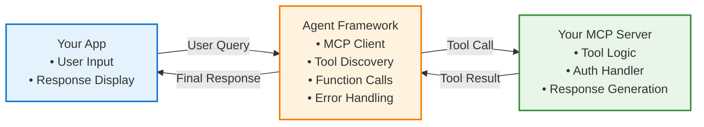
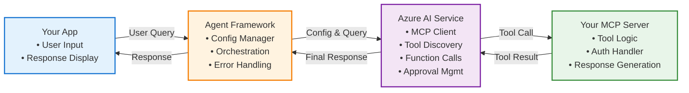
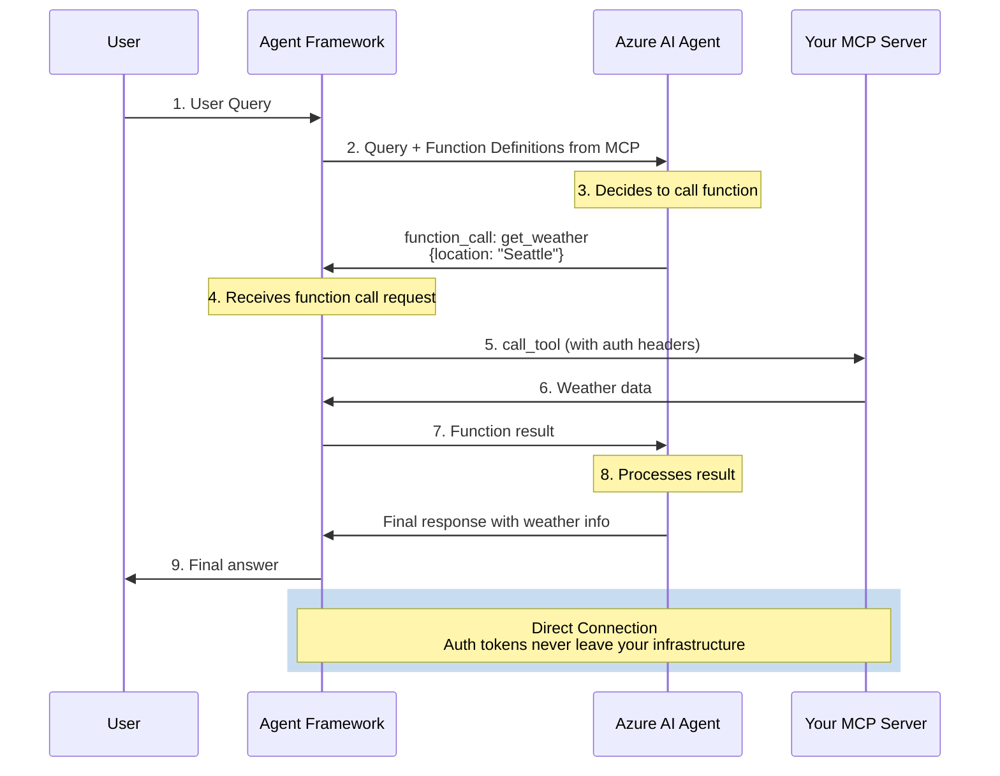
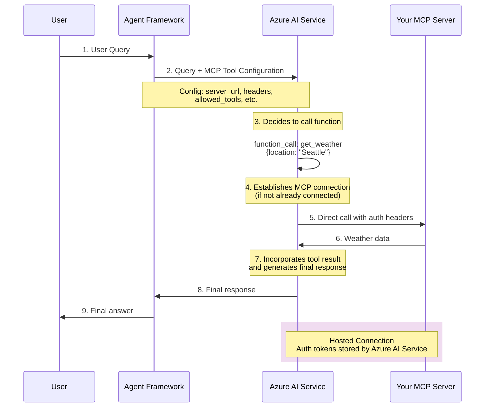

# Agent Framework MCP Notes

Repo: [agent-framework](https://github.com/microsoft/agent-framework/)

There are 4 different implementations for using an MCP server with the Agent Framework.

- #MCPStreamableHTTPTool (direct connection)
- #MCPStdioTool (direct connection)
- #MCPWebsocketTool (direct connection)
- #HostedMCPTool (remote)

## TLDR;
#HostedMCPTool and #MCPStreamableHTTPTool implementations support passing headers (i.e. Authorization token) to the MCP server. 
The MCP Tools that have **direct connection** allow you to have more control over access to the MCP server, for example:
    - MCP server can be hosted privately with no public access
    - Auth tokens are not sent and stored in Azure AI Foundry Service

### Direct Connection Flow



### HostedMCPTool Flow



**Direct Connection Tools:**
- MCP server can be hosted privately (no public access required)
- Auth tokens never leave your infrastructure
- Full control over connection lifecycle and security

**HostedMCPTool:**
- Auth tokens stored by Azure AI Service
- MCP server must be accessible to Azure AI Service
- Enterprise approval workflows and audit trails
- Azure handles security, compliance, and connection management

## Tool Registration ([example](https://github.com/microsoft/agent-framework/blob/main/python/samples/getting_started/agents/azure_ai/azure_ai_with_local_mcp.py))
#MCPStreamableHTTPTool #HostedMCPTool  #MCPStdioTool #MCPWebsocketTool 

There are 2 ways to register/use the tools:
- **Agent level** - This sets the tools when the agent is created. All subsequent calls to the `await agent.run(query)` can use the tools
- **Run level** - This sets the tools when calling the run method `await agent.run(query, tools=mcp_server)`

Tool registration (agent level)
```python
async with (
        AzureCliCredential() as credential,
        AzureAIAgentClient(async_credential=credential).create_agent(
            name="DocsAgent",
            instructions="You are a helpful assistant that can help answer questions.",
            # Framework connects to YOUR MCP server and discovers tools
      # Framework converts MCP tools into OpenAI/Azure AI function definitions
            tools=MCPStreamableHTTPTool(  # Tools defined at agent creation
                name="My MCP Server",
       url="https://my-server.com/mcp",
       headers={"Authorization": "Bearer your-token"}
            ),
        ) as agent,
    ):
```

Run (agent level)
```python
result = await agent.run("What's the weather in Seattle?")
```
## Direct Connection Tools
#MCPStreamableHTTPTool #MCPStdioTool #MCPWebsocketTool

Code: [`/python/packages/core/agent_framework/_mcp.py`](https://github.com/microsoft/agent-framework/blob/main/python/packages/core/agent_framework/_mcp.py)

In the Agent Framework, when direct connection tools are instantiated, they establish **direct connections** to your MCP server from within your application. Unlike HostedMCPTool, the Agent Framework acts as the **MCP client** and manages all communication with your server.

When the connection is established, the Agent Framework discovers the available tools from your MCP server and converts them into `AIFunction` objects. These functions are then presented to Azure AI Service as **standard OpenAI function definitions** - Azure AI has no knowledge that these functions are backed by an MCP server. The Agent Framework handles all MCP protocol communication locally within your infrastructure.
```python
# Create AIFunctions out of each tool
func: AIFunction[BaseModel, list[Contents]] = AIFunction(
    func=partial(self.call_tool, tool.name),  # <-- This wraps the MCP call
    name=local_name,
    description=tool.description or "",
    input_model=input_model,
)
self.functions.append(func)
```
### Detailed Execution Flow



[call_tool implementation](https://github.com/microsoft/agent-framework/blob/main/python/packages/core/agent_framework/_mcp.py#L540)

## HostedMCPTool (Service Managed Tool)
#HostedMCPTool

Code: [`/python/packages/core/agent_framework/_tools.py`](https://github.com/microsoft/agent-framework/blob/main/python/packages/core/agent_framework/_tools.py#L358)

In the Agent Framework, when `HostedMCPTool` is instantiated, it creates a **configuration object** that is passed to the Azure AI Service. Unlike direct connection tools, the Agent Framework does **not** connect to the MCP server directly. Instead, Azure AI Service manages all MCP communication.

When the tool configuration is processed, Azure AI Service discovers the available tools and manages them internally. **No `AIFunction` objects are created** in the Agent Framework - the Azure AI Service handles tool discovery, connection management, and execution.

### Detailed Execution Flow



**MCP Tool Configuration sent to Azure:**
```json
{
  "messages": [{"role": "user", "content": "What's the weather in Seattle?"}],
  "tools": [{
    "type": "mcp",
    "server_label": "My_Custom_MCP_Server", 
    "server_url": "https://my-server.com/mcp",
    "headers": {"Authorization": "Bearer your-token"},
    "allowed_tools": ["get_weather"]
  }]
}
```