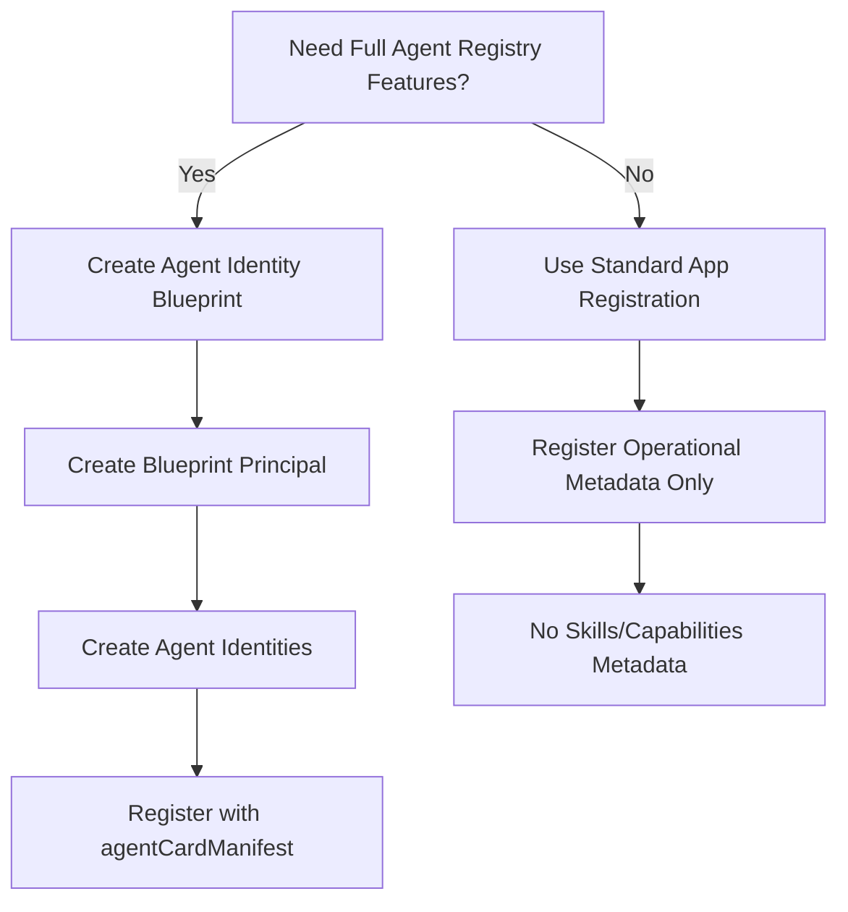

# Microsoft Entra Agent ID - Comprehensive API Documentation

**Date:** January 19, 2026  
**Sources:** Official Microsoft Learn Documentation

---

## Table of Contents
1. [Overview](#overview)
2. [Agent Identity Blueprint](#agent-identity-blueprint)
3. [Agent Identity Blueprint Principal](#agent-identity-blueprint-principal)
4. [Agent Identity](#agent-identity)
5. [Graph API Permissions](#graph-api-permissions)
6. [Token Claims Reference](#token-claims-reference)
7. [Key Findings & Implementation Guidance](#key-findings--implementation-guidance)

---

## Overview

Microsoft Entra Agent ID provides a comprehensive identity platform for AI agents, enabling them to authenticate, authorize, and interact securely within the Microsoft 365 ecosystem. The system consists of three core resource types that work together to create a complete agent identity infrastructure.

### Architecture Hierarchy

```
┌─────────────────────────────────────┐
│  Agent Identity Blueprint           │  ← Template/Definition
│  (Application Type)                 │
└─────────────────────┬───────────────┘
                      │
                      │ creates instances of
                      ▼
┌─────────────────────────────────────┐
│  Agent Identity Blueprint Principal │  ← Service Principal
│  (Tenant-level)                     │
└─────────────────────┬───────────────┘
                      │
                      │ instantiates
                      ▼
┌─────────────────────────────────────┐
│  Agent Identity                     │  ← Actual Agent Instance
│  (Runtime Identity)                 │
└─────────────────────────────────────┘
```

---

## Agent Identity Blueprint

### Definition
An **Agent Identity Blueprint** serves as a **template** for creating agent identities within Microsoft Entra ID. It inherits from the `application` resource type and provides the configuration schema for agent identities.

### Key Characteristics
- **Type**: Special application type (`#microsoft.graph.agentIdentityBlueprint`)
- **Purpose**: Defines reusable configurations for agent identities
- **Inheritance**: Extends `microsoft.graph.application`
- **Lifecycle**: Create once, use many times to instantiate agent identities

### Critical Methods

#### Create
```http
POST /beta/applications/graph.agentIdentityBlueprint
Content-Type: application/json

{
  "@odata.type": "Microsoft.Graph.AgentIdentityBlueprint",
  "displayName": "My Agent Blueprint",
  "sponsors@odata.bind": [
    "https://graph.microsoft.com/v1.0/users/{user-id}"
  ],
  "owners@odata.bind": [
    "https://graph.microsoft.com/v1.0/users/{user-id}"
  ]
}
```

#### List Blueprints
```http
GET /beta/applications/graph.agentIdentityBlueprint
```

#### Get Specific Blueprint
```http
GET /beta/applications/graph.agentIdentityBlueprint/{blueprint-id}
```

#### Update Blueprint
```http
PATCH /beta/applications/graph.agentIdentityBlueprint/{blueprint-id}
Content-Type: application/json

{
  "displayName": "Updated Blueprint Name"
}
```

#### Delete Blueprint
```http
DELETE /beta/applications/graph.agentIdentityBlueprint/{blueprint-id}
```

### Credential Management

#### Add Password (Client Secret)
```http
POST /beta/applications/graph.agentIdentityBlueprint/{blueprint-id}/addPassword
Content-Type: application/json

{
  "passwordCredential": {
    "displayName": "Agent Secret",
    "endDateTime": "2027-12-31T23:59:59Z"
  }
}
```

**Response:**
```json
{
  "customKeyIdentifier": null,
  "displayName": "Agent Secret",
  "endDateTime": "2027-12-31T23:59:59.000Z",
  "hint": "abc",
  "keyId": "guid",
  "secretText": "SECRET_VALUE_SHOWN_ONCE",
  "startDateTime": "2025-01-19T00:00:00.000Z"
}
```

#### Add Certificate (Key Credential)
```http
POST /beta/applications/graph.agentIdentityBlueprint/{blueprint-id}/addKey
Content-Type: application/json

{
  "keyCredential": {
    "type": "AsymmetricX509Cert",
    "usage": "Verify",
    "key": "BASE64_ENCODED_CERTIFICATE"
  },
  "passwordCredential": null,
  "proof": "JWT_TOKEN"
}
```

#### Federated Identity Credentials
```http
POST /beta/applications/graph.agentIdentityBlueprint/{blueprint-id}/federatedIdentityCredentials
Content-Type: application/json

{
  "name": "MyFederatedIdentity",
  "issuer": "https://token.actions.githubusercontent.com",
  "subject": "repo:owner/repo:environment:production",
  "audiences": ["api://AzureADTokenExchange"]
}
```

### Sponsors & Owners Management

#### List Sponsors
```http
GET /beta/applications/graph.agentIdentityBlueprint/{blueprint-id}/sponsors
```

#### Add Sponsor
```http
POST /beta/applications/graph.agentIdentityBlueprint/{blueprint-id}/sponsors/$ref
Content-Type: application/json

{
  "@odata.id": "https://graph.microsoft.com/v1.0/users/{user-id}"
}
```

#### Remove Sponsor
```http
DELETE /beta/applications/graph.agentIdentityBlueprint/{blueprint-id}/sponsors/{user-id}/$ref
```

### Inheritable Permissions

Defines scopes that can be automatically granted to agent identities without additional consent.

```http
POST /beta/applications/graph.agentIdentityBlueprint/{blueprint-id}/inheritablePermissions
Content-Type: application/json

{
  "permissionId": "guid",
  "permissionType": "delegated",
  "resourceAppId": "resource-app-id"
}
```

### Essential Properties

| Property | Type | Description |
|----------|------|-------------|
| `id` | String | Object ID (read-only) |
| `appId` | String | Application (Client) ID (read-only) |
| `displayName` | String | Display name (max 256 chars) |
| `description` | String | Description (max 1024 chars) |
| `identifierUris` | String[] | App ID URI (e.g., `api://{appId}`) |
| `api` | apiApplication | Web API settings including OAuth scopes |
| `appRoles` | appRole[] | Roles that can be assigned |
| `keyCredentials` | keyCredential[] | Certificate credentials |
| `passwordCredentials` | passwordCredential[] | Client secrets |
| `signInAudience` | String | `AzureADMyOrg`, `AzureADMultipleOrgs`, etc. |
| `tags` | String[] | Custom tags for categorization |
| `web` | webApplication | Web application settings |
| `createdDateTime` | DateTimeOffset | Creation timestamp (read-only) |
| `publisherDomain` | String | Verified publisher domain (read-only) |

### Relationships

| Relationship | Type | Description |
|--------------|------|-------------|
| `owners` | directoryObject[] | Non-admin users/SPs who can modify |
| `sponsors` | directoryObject[] | Users/SPs who authorize agent lifecycle |
| `inheritablePermissions` | inheritablePermission[] | Auto-granted permissions |
| `federatedIdentityCredentials` | federatedIdentityCredential[] | Federated auth configs |
| `appManagementPolicies` | appManagementPolicy[] | Applied policies |

---

## Agent Identity Blueprint Principal

### Definition
An **Agent Identity Blueprint Principal** is the **service principal** instantiation of an Agent Identity Blueprint in a tenant. It represents the blueprint at the tenant level and is used to create individual agent identities.

### Key Characteristics
- **Type**: Service principal (`#microsoft.graph.agentIdentityBlueprintPrincipal`)
- **Purpose**: Tenant-level representation enabling agent identity creation
- **Inheritance**: Extends `microsoft.graph.servicePrincipal`
- **Relationship**: One-to-one with Agent Identity Blueprint

### Critical Methods

#### Create
```http
POST /beta/serviceprincipals/graph.agentIdentityBlueprintPrincipal
Content-Type: application/json

{
  "appId": "{blueprint-app-id}"
}
```

#### List Principals
```http
GET /beta/serviceprincipals/graph.agentIdentityBlueprintPrincipal
```

#### Get Specific Principal
```http
GET /beta/serviceprincipals/graph.agentIdentityBlueprintPrincipal/{principal-id}
```

#### Update Principal
```http
PATCH /beta/serviceprincipals/graph.agentIdentityBlueprintPrincipal/{principal-id}
Content-Type: application/json

{
  "displayName": "Updated Principal Name"
}
```

#### Delete Principal
```http
DELETE /beta/serviceprincipals/graph.agentIdentityBlueprintPrincipal/{principal-id}
```

### App Role Assignments

#### List Assigned Roles
```http
GET /beta/serviceprincipals/graph.agentIdentityBlueprintPrincipal/{principal-id}/appRoleAssignedTo
```

#### Assign App Role
```http
POST /beta/serviceprincipals/graph.agentIdentityBlueprintPrincipal/{principal-id}/appRoleAssignedTo
Content-Type: application/json

{
  "principalId": "{user-or-group-id}",
  "resourceId": "{service-principal-id}",
  "appRoleId": "{role-id}"
}
```

### OAuth2 Permission Grants

```http
GET /beta/serviceprincipals/graph.agentIdentityBlueprintPrincipal/{principal-id}/oauth2PermissionGrants
```

### Essential Properties

| Property | Type | Description |
|----------|------|-------------|
| `id` | String | Service principal ID (read-only) |
| `appId` | String | Associated blueprint application ID |
| `displayName` | String | Display name |
| `accountEnabled` | Boolean | Whether account is enabled |
| `appDisplayName` | String | Display name from blueprint |
| `appDescription` | String | Description from blueprint |
| `appOwnerOrganizationId` | Guid | Tenant ID of blueprint registration |
| `appRoleAssignmentRequired` | Boolean | Whether role assignment required |
| `servicePrincipalType` | String | Set to `Application` |
| `signInAudience` | String | Supported account types |
| `publishedPermissionScopes` | permissionScope[] | Delegated permissions exposed |
| `tags` | String[] | Custom tags |

### Relationships

| Relationship | Type | Description |
|--------------|------|-------------|
| `owners` | directoryObject[] | Owners of the principal |
| `sponsors` | directoryObject[] | Sponsors for agent lifecycle |
| `appRoleAssignedTo` | appRoleAssignment[] | App roles granted to users/groups |
| `appRoleAssignments` | appRoleAssignment[] | App roles granted to this principal |
| `oauth2PermissionGrants` | oAuth2PermissionGrant[] | Delegated permission grants |
| `memberOf` | directoryObject[] | Groups this principal is member of |
| `ownedObjects` | directoryObject[] | Objects owned by principal |
| `createdObjects` | directoryObject[] | Objects created by principal |

---

## Agent Identity

### Definition
An **Agent Identity** is an actual **runtime identity** used by AI agents to authenticate and access resources within Microsoft Entra ID. It's an instance created from an Agent Identity Blueprint Principal.

### Key Characteristics
- **Type**: Service principal (`#microsoft.graph.agentIdentity`)
- **Purpose**: Runtime authentication and authorization for agents
- **Inheritance**: Extends `microsoft.graph.servicePrincipal`
- **Relationship**: Many agent identities can be created from one blueprint

### Critical Methods

#### Create
```http
POST /beta/servicePrincipals/graph.agentIdentity
Content-Type: application/json

{
  "displayName": "My Agent Instance",
  "agentIdentityBlueprintId": "{blueprint-app-id}",
  "accountEnabled": true
}
```

#### List Agent Identities
```http
GET /beta/servicePrincipals/graph.agentIdentity
```

#### Get Specific Agent Identity
```http
GET /beta/servicePrincipals/graph.agentIdentity/{agent-id}
```

#### Update Agent Identity
```http
PATCH /beta/servicePrincipals/graph.agentIdentity/{agent-id}
Content-Type: application/json

{
  "displayName": "Updated Agent Name",
  "accountEnabled": false
}
```

### App Role Management

#### List App Role Assignments
```http
GET /beta/servicePrincipals/graph.agentIdentity/{agent-id}/appRoleAssignments
```

#### Assign App Role
```http
POST /beta/servicePrincipals/graph.agentIdentity/{agent-id}/appRoleAssignments
Content-Type: application/json

{
  "principalId": "{agent-id}",
  "resourceId": "{resource-service-principal-id}",
  "appRoleId": "{role-id}"
}
```

### Membership Management

#### List Direct Memberships
```http
GET /beta/servicePrincipals/graph.agentIdentity/{agent-id}/memberOf
```

#### List Transitive Memberships
```http
GET /beta/servicePrincipals/graph.agentIdentity/{agent-id}/transitiveMemberOf
```

### Essential Properties

| Property | Type | Description |
|----------|------|-------------|
| `@odata.type` | String | `#microsoft.graph.agentIdentity` |
| `id` | String | Unique agent identity ID (read-only) |
| `displayName` | String | Agent display name |
| `accountEnabled` | Boolean | Whether account is active |
| `agentIdentityBlueprintId` | String | Reference to parent blueprint appId |
| `servicePrincipalType` | String | Set to `ServiceIdentity` |
| `createdDateTime` | DateTimeOffset | Creation timestamp (read-only) |
| `createdByAppId` | String | App that created this identity |
| `disabledByMicrosoftStatus` | String | Disabled status if any |
| `tags` | String[] | Custom categorization tags |
| `customSecurityAttributes` | customSecurityAttributeValue | Custom security attributes |

### Relationships

| Relationship | Type | Description |
|--------------|------|-------------|
| `owners` | directoryObject[] | Owners of this agent identity |
| `sponsors` | directoryObject[] | Sponsors for this agent |
| `appRoleAssignments` | appRoleAssignment[] | App roles granted to agent |
| `oauth2PermissionGrants` | oAuth2PermissionGrant[] | Delegated permissions |
| `memberOf` | directoryObject[] | Groups agent belongs to |
| `transitiveMemberOf` | directoryObject[] | All group memberships (transitive) |
| `ownedObjects` | directoryObject[] | Objects owned by agent |
| `createdObjects` | directoryObject[] | Objects created by agent |

---

## Graph API Permissions

### Agent Identity Blueprint Permissions

#### Create Blueprints
| Permission | Type | ID | Admin Consent Required |
|------------|------|-----|----------------------|
| `AgentIdentityBlueprint.Create` | Application | `ea4b2453-ad2d-4d94-9155-10d5d9493ce9` | Yes |
| `AgentIdentityBlueprint.Create` | Delegated | `8fc15edd-ba24-494e-83f7-912d-5cca239e90e6` | Yes |

#### Read Blueprints
| Permission | Type | ID | Admin Consent Required |
|------------|------|-----|----------------------|
| `AgentIdentityBlueprint.Read.All` | Application | `7547a7d1-36fa-4479-9c31-559a600eaa4f` | Yes |
| `AgentIdentityBlueprint.Read.All` | Delegated | `26512dc8-1364-4e9f-867c-6d8b22a9e162` | Yes |

#### Manage Blueprints
| Permission | Type | ID | Admin Consent Required |
|------------|------|-----|----------------------|
| `AgentIdentityBlueprint.ReadWrite.All` | Application | `7fddd33b-d884-4ec0-8696-72cff90ff825` | Yes |
| `AgentIdentityBlueprint.ReadWrite.All` | Delegated | `4fd490fc-1467-48eb-8a4c-421597ab0402` | Yes |

#### Delete/Restore Blueprints
| Permission | Type | ID | Admin Consent Required |
|------------|------|-----|----------------------|
| `AgentIdentityBlueprint.DeleteRestore.All` | Application | `3f80b699-6405-4e36-a4df-4f19950ff91e` | Yes |
| `AgentIdentityBlueprint.DeleteRestore.All` | Delegated | `f12ba1f6-afb7-4685-9a30-21e8c3f551d8` | Yes |

#### Manage Credentials
| Permission | Type | ID | Admin Consent Required |
|------------|------|-----|----------------------|
| `AgentIdentityBlueprint.AddRemoveCreds.All` | Application | `0510736e-bdfb-4b37-9a1f-89b4a074763a` | Yes |
| `AgentIdentityBlueprint.AddRemoveCreds.All` | Delegated | `75b5feb2-bfe7-423f-907d-cc505186f246` | Yes |

### Agent Identity Blueprint Principal Permissions

#### Create Principals
| Permission | Type | ID | Admin Consent Required |
|------------|------|-----|----------------------|
| `AgentIdentityBlueprintPrincipal.Create` | Application | `8959696d-d07e-4916-9b1e-3ba9ce459161` | Yes |
| `AgentIdentityBlueprintPrincipal.Create` | Delegated | `00dcd896-6b23-42ce-b5de-c58493c05e22` | Yes |

#### Read Principals
| Permission | Type | ID | Admin Consent Required |
|------------|------|-----|----------------------|
| `AgentIdentityBlueprintPrincipal.Read.All` | Application | `9361dea9-4524-493d-941d-f1b65aaf6c7c` | Yes |
| `AgentIdentityBlueprintPrincipal.Read.All` | Delegated | `88c856a2-de61-4632-b2d4-ac503cbc8dd2` | Yes |

#### Manage Principals
| Permission | Type | ID | Admin Consent Required |
|------------|------|-----|----------------------|
| `AgentIdentityBlueprintPrincipal.ReadWrite.All` | Application | `3bc933bc-8b4d-4cb6-ac49-b73774299250` | Yes |
| `AgentIdentityBlueprintPrincipal.ReadWrite.All` | Delegated | `bf2cad6a-9082-438a-9a63-95fa2687af65` | Yes |

### Agent Identity Permissions

#### Create Agent Identities
| Permission | Type | ID | Admin Consent Required |
|------------|------|-----|----------------------|
| `AgentIdentity.CreateAsManager` | Application | `4c390976-b2b7-42e0-9187-c6be3bead001` | Yes |
| `AgentIdentity.Create.All` | Application | `ad25cc1d-84d8-47df-a08e-b34c2e800819` | Yes |

#### Read Agent Identities
| Permission | Type | ID | Admin Consent Required |
|------------|------|-----|----------------------|
| `AgentIdentity.Read.All` | Application | `b2b8f011-2898-4234-9092-5059f6c1ebfa` | Yes |
| `AgentIdentity.Read.All` | Delegated | `5e850691-d86a-4b24-bfa6-8a52fb37a0c1` | Yes |

#### Manage Agent Identities
| Permission | Type | ID | Admin Consent Required |
|------------|------|-----|----------------------|
| `AgentIdentity.ReadWrite.All` | Application | `dcf7150a-88d4-4fe6-9be1-c2744c455397` | Yes |
| `AgentIdentity.ReadWrite.All` | Delegated | `4a4facd5-0ee1-49b7-a5b2-fdcc2491685e` | Yes |

#### Enable/Disable Agent Identities
| Permission | Type | ID | Admin Consent Required |
|------------|------|-----|----------------------|
| `AgentIdentity.EnableDisable.All` | Application | `69ee0943-4fa4-4ec8-8e5220f39` | Yes |
| `AgentIdentity.EnableDisable.All` | Delegated | `a501206a-e364-4a3f-be6e-765806d0e323` | Yes |

#### Delete/Restore Agent Identities
| Permission | Type | ID | Admin Consent Required |
|------------|------|-----|----------------------|
| `AgentIdentity.DeleteRestore.All` | Application | `5b016f9b-18eb-41d4-869a-66931914d1c8` | Yes |
| `AgentIdentity.DeleteRestore.All` | Delegated | `c8ee41e5-35e7-4fe9-8ecb-93493adcac5b` | Yes |

### Agent Registry Permissions

#### Agent Instance Registry
| Permission | Type | ID | Admin Consent Required |
|------------|------|-----|----------------------|
| `AgentInstance.Read.All` | Application | `799a4732-85b8-4c67-b048-75f0e88a232b` | Yes |
| `AgentInstance.Read.All` | Delegated | `4c3c738a-2df0-4877-bf4a-f796950ff34c` | Yes |
| `AgentInstance.ReadWrite.All` | Application | `07abdd95-78dc-4353-bd32-09f880ea43d0` | Yes |
| `AgentInstance.ReadWrite.All` | Delegated | `fc79e324-da24-497a-b5ec-e7de08320375` | Yes |
| `AgentInstance.ReadWrite.ManagedBy` | Application | `782ab1bf-24f1-4c27-8bbc-2006d42792a6` | Yes |

#### Agent Card Manifest
| Permission | Type | ID | Admin Consent Required |
|------------|------|-----|----------------------|
| `AgentCardManifest.Read.All` | Application | `3ee18438-e6e5-4858-8f1c-d7b723b45213` | Yes |
| `AgentCardManifest.Read.All` | Delegated | `ada96a26-9579-4c29-a578-c3482a765716` | Yes |
| `AgentCardManifest.ReadWrite.All` | Application | `228b1a03-f7ca-4348-b50d-e8a547ab61af` | Yes |
| `AgentCardManifest.ReadWrite.All` | Delegated | `80151b1a-1c31-4846-ae0d-c79939ee13d1` | Yes |
| `AgentCardManifest.ReadWrite.ManagedBy` | Application | `77f6034c-52f5-4526-9fa1-d55a67e72cc4` | Yes |

#### Agent Collections
| Permission | Type | ID | Admin Consent Required |
|------------|------|-----|----------------------|
| `AgentCollection.Read.All` | Application | `e65ee1da-d1d5-467b-bdd0-3e9bb94e6e0c` | Yes |
| `AgentCollection.Read.All` | Delegated | `fa50be38-fdff-469c-96dc-ef5fce3c64bf` | Yes |
| `AgentCollection.ReadWrite.All` | Application | `feb31d7d-a227-4487-898c-e014840d07b3` | Yes |
| `AgentCollection.ReadWrite.All` | Delegated | `6d8a7002-a05e-4b95-a768-0e6f0badc6c8` | Yes |

---

## Token Claims Reference

### Core Token Structure

When an agent identity authenticates, it receives an access token with specialized claims. Here's a sample token for an agent acting autonomously:

```json
{
  "aud": "f2510d34-8dca-4ab8-a0bc-aaec4d3a3e36",
  "iss": "https://sts.windows.net/00000001-0000-0ff1-ce00-000000000000/",
  "iat": 1753392285,
  "nbf": 1753392285,
  "exp": 1753421385,
  "aio": "Y2JgYGhn1nzmErKqi0vc4Fr6H22/C5/4FP+xZbZYpik8nRkp+gEA",
  "appid": "aaaaaaaa-1111-2222-3333-444444444444",
  "appidacr": "2",
  "idp": "https://sts.windows.net/00000001-0000-0ff1-ce00-000000000000/",
  "idtyp": "app",
  "oid": "bbbbbbbb-1111-2222-3333-444444444444",
  "rh": "1.AAAAAQAAAAAA8Q_OAAAAAAAAADQNUfLKjbhKoLyq7E06PjYAAAAAAA.",
  "sub": "cccccccc-1111-2222-3333-444444444444",
  "tid": "00000001-0000-0ff1-ce00-000000000000",
  "uti": "m5RaaRnoFUyp2TbSCAAAAA",
  "ver": "1.0",
  "xms_act_fct": "3 9 11",
  "xms_ftd": "Z5DrW4HFOkR_Lz0M5qETa260d2-fO6seMZJ_tOwRNuc",
  "xms_idrel": "7 10",
  "xms_sub_fct": "9 3 11",
  "xms_tnt_fct": "3 9",
  "xms_par_app_azp": "30cf4c22-9985-4ef7-8756-91cc888176bd"
}
```

### Standard Claims

| Claim | Description | Example |
|-------|-------------|---------|
| `aud` | Audience - the resource API being accessed | `f2510d34-8dca-4ab8-a0bc-aaec4d3a3e36` |
| `iss` | Issuer - Microsoft Entra ID token endpoint | `https://sts.windows.net/{tenant-id}/` |
| `iat` | Issued At - Unix timestamp | `1753392285` |
| `nbf` | Not Before - Unix timestamp | `1753392285` |
| `exp` | Expiration - Unix timestamp | `1753421385` |
| `tid` | Tenant ID where agent is registered | `00000001-0000-0ff1-ce00-000000000000` |
| `sub` | Subject - entity being authenticated | Service principal OID or user OID |
| `oid` | Object ID of the subject | Agent identity's object ID |
| `appid` / `azp` | Application ID of the agent identity | `aaaaaaaa-1111-2222-3333-444444444444` |
| `idtyp` | Identity type: `app` or `user` | `app` |
| `appidacr` | App authentication context class | `2` (client secret), `1` (cert) |
| `scp` | Scopes (delegated permissions) | `User.Read Mail.Send` or `/` for app-only |
| `roles` | App roles (application permissions) | `["User.Read.All"]` |

### Agent-Specific Claims

#### xms_idrel - Identity Relationship

Indicates the relationship between the entity and the resource tenant.

| Value | Description |
|-------|-------------|
| `1` | Member user |
| `3` | MSA member user |
| `5` | Guest user |
| `7` | **Service principal** (most common for agents) |
| `9` | Device principal |
| `11` | GDAP user |
| `13` | SPLess application |
| `17` | Native identity user with profile |
| `19` | Native identity user |
| `21` | Native identity Teams meeting participant |
| `25` | Native identity content sharing user |
| `31` | DAP user |
| `33` | Federated managed identity |

**Example:** `"xms_idrel": "7"` indicates a service principal.

#### xms_act_fct - Actor Facets

Describes facts about the **actor** (the entity performing the action, identified by `azp`/`appid`).

| Value | Description |
|-------|-------------|
| `11` | **AgentIdentity** - The actor is an agent identity |
| `13` | AgentIDUser - The actor is an agent user |

**Example:** `"xms_act_fct": "3 9 11"` - The actor is an agent identity (value `11`).

#### xms_sub_fct - Subject Facets

Describes facts about the **subject** (the entity identified by `sub`).

| Value | Description |
|-------|-------------|
| `11` | **AgentIdentity** - Subject is an agent identity |
| `13` | **AgentIDUser** - Subject is an agent user |

**Example for autonomous agent:** `"xms_sub_fct": "9 3 11"` - Subject is an agent identity (value `11`).

#### xms_tnt_fct - Tenant Facets

Describes facts about the **tenant** (identified by `tid`).

| Value | Description |
|-------|-------------|
| `3` | Standard tenant |
| `9` | Special tenant type |

**Example:** `"xms_tnt_fct": "3 9"` 

#### xms_par_app_azp - Parent Application

The application ID of the **parent application** (the Agent Identity Blueprint) that created this agent identity.

**Example:** `"xms_par_app_azp": "30cf4c22-9985-4ef7-8756-91cc888176bd"`

**Important:** This should be logged for audit purposes but should **NOT** be used for authorization decisions, as it would grant access to all agents from the same blueprint.

### Scenario-Specific Token Examples

#### Scenario 1: Agent Acting on Behalf of a User (Delegated)

```json
{
  "tid": "tenant-id",
  "idtyp": "user",
  "xms_idrel": "1",
  "azp": "agent-app-id",
  "scp": "User.Read Mail.Send",
  "oid": "user-object-id",
  "aud": "resource-app-id",
  "xms_act_fct": "11"
}
```

**Key Points:**
- `idtyp` = `user` (subject is human user)
- `xms_idrel` = `1` (member user)
- `scp` contains delegated permissions
- `xms_act_fct` = `11` (actor is agent identity)

#### Scenario 2: Agent Acting Autonomously (App-Only)

```json
{
  "tid": "tenant-id",
  "idtyp": "app",
  "xms_idrel": "7",
  "azp": "agent-app-id",
  "roles": ["User.Read.All"],
  "oid": "agent-object-id",
  "xms_act_fct": "11",
  "xms_sub_fct": "11",
  "aud": "resource-app-id",
  "scp": "/"
}
```

**Key Points:**
- `idtyp` = `app` (subject is application/agent)
- `xms_idrel` = `7` (service principal)
- `roles` contains application permissions
- `scp` = `/` (unscoped for app-only)
- Both `xms_act_fct` and `xms_sub_fct` = `11` (agent identity)

#### Scenario 3: Agent Acting via Agent User

```json
{
  "tid": "tenant-id",
  "idtyp": "user",
  "xms_idrel": "1",
  "azp": "agent-app-id",
  "scp": "User.Read Files.ReadWrite",
  "oid": "agent-user-object-id",
  "xms_act_fct": "11",
  "xms_sub_fct": "13",
  "aud": "resource-app-id"
}
```

**Key Points:**
- `idtyp` = `user` (subject is agent user account)
- `xms_act_fct` = `11` (actor is agent identity)
- `xms_sub_fct` = `13` (subject is agent user)

### Token Validation Best Practices

1. **Always validate standard claims:**
   - `iss` (issuer)
   - `aud` (audience)
   - `exp` (expiration)
   - `nbf` (not before)

2. **Check agent-specific facets:**
   ```csharp
   if (token.Claims.Contains("xms_act_fct", "11")) {
       // This is an agent identity
   }
   ```

3. **Log parent application for audit:**
   ```csharp
   var parentAppId = token.Claims["xms_par_app_azp"];
   Logger.LogAuditEvent($"Agent from parent: {parentAppId}");
   ```

4. **Don't use parent app for authZ:**
   ❌ **Bad:** Allow all agents from blueprint X
   ✅ **Good:** Check specific agent identity and its permissions

5. **Handle delegated vs app-only:**
   ```csharp
   if (token.Claims["scp"] != "/" && !string.IsNullOrEmpty(token.Claims["scp"])) {
       // Delegated permissions
   } else if (token.Claims.ContainsKey("roles")) {
       // Application permissions
   }
   ```

---

## Key Findings & Implementation Guidance

### Critical Discovery: Why Agent Card Manifest Registration Failed

#### The Problem
Standard app registrations (created via `POST /applications`) **cannot register agentCardManifest** to the Agent Registry. This returns **403 Forbidden** regardless of Graph API permissions granted.

#### The Root Cause
The `agentCardManifest` field in the Agent Registry is **restricted to Agent Identity Blueprints only**. Standard applications don't have the architectural capability to use this field.

#### Evidence from Testing
```http
POST /beta/agentRegistry/agentInstances
{
  "displayName": "Test Agent",
  "agentIdentityId": "standard-app-id",
  "agentCardManifest": { ... }
}

Response: 403 Forbidden
{
  "error": {
    "code": "Forbidden",
    "message": "Insufficient privileges to complete the operation."
  }
}
```

#### The Solution
To register full agent metadata (including skills, capabilities, security schemes), you **must** use an Agent Identity Blueprint:



### Implementation Patterns

#### Pattern 1: Standard App Registration (Limited)
```http
POST /beta/agentRegistry/agentInstances
{
  "displayName": "Limited Agent",
  "sourceAgentId": "unique-id",
  "originatingStore": "My Platform",
  "url": "https://example.com/agent",
  "preferredTransport": "JSONRPC",
  "agentIdentityId": "standard-app-client-id"
}
```
**Result:** ✅ Operational metadata registered  
**Limitation:** ❌ No agent card manifest (skills, capabilities)

#### Pattern 2: Agent Identity Blueprint (Full Features)
```http
# Step 1: Create Blueprint
POST /beta/applications/graph.agentIdentityBlueprint
{
  "displayName": "My Agent Blueprint",
  "sponsors@odata.bind": ["..."],
  "owners@odata.bind": ["..."]
}

# Step 2: Create Principal
POST /beta/serviceprincipals/graph.agentIdentityBlueprintPrincipal
{
  "appId": "{blueprint-app-id}"
}

# Step 3: Register with Full Metadata
POST /beta/agentRegistry/agentInstances
{
  "displayName": "Full-Featured Agent",
  "sourceAgentId": "unique-id",
  "originatingStore": "My Platform",
  "url": "https://example.com/agent",
  "preferredTransport": "JSONRPC",
  "agentIdentityId": "{blueprint-app-id}",
  "agentCardManifest": {
    "displayName": "Agent Name",
    "skills": [...],
    "capabilities": {...},
    "securitySchemes": {...}
  }
}
```
**Result:** ✅ Full agent metadata registered  
**Benefit:** ✅ Discoverable skills and capabilities

### Required Permissions Comparison

#### Standard App Registration
```
✅ AgentInstance.ReadWrite.All
✅ Minimal API permissions
✅ No special admin roles required
❌ Cannot register agentCardManifest
```

#### Agent Identity Blueprint
```
✅ AgentIdentityBlueprint.Create (requires Global Admin or Privileged Role Admin)
✅ AgentIdentityBlueprintPrincipal.Create
✅ AgentInstance.ReadWrite.All
✅ AgentCardManifest.ReadWrite.All
✅ Requires Agent ID Administrator or Agent ID Developer role
✅ Can register full agent metadata
```

### When to Use Each Approach

| Use Case | Recommended Approach |
|----------|---------------------|
| Quick prototype/testing | Standard App Registration |
| Internal agent (no discovery needs) | Standard App Registration |
| Production agent with discovery | Agent Identity Blueprint |
| Multi-agent platform | Agent Identity Blueprint |
| Agent marketplace/catalog | Agent Identity Blueprint |
| Minimal permissions required | Standard App Registration |
| Full agent lifecycle management | Agent Identity Blueprint |

### Code Examples

#### Python: Create Agent Identity Blueprint
```python
import requests
from azure.identity import ClientSecretCredential

# Authenticate as Global Admin
credential = ClientSecretCredential(
    tenant_id="your-tenant-id",
    client_id="admin-app-id",
    client_secret="admin-secret"
)

token = credential.get_token("https://graph.microsoft.com/.default").token
headers = {
    "Authorization": f"Bearer {token}",
    "Content-Type": "application/json"
}

# Get current user to set as sponsor/owner
user_response = requests.get(
    "https://graph.microsoft.com/v1.0/me",
    headers=headers
)
user_id = user_response.json()["id"]

# Create blueprint
blueprint_payload = {
    "@odata.type": "Microsoft.Graph.AgentIdentityBlueprint",
    "displayName": "Production Agent Blueprint",
    "sponsors@odata.bind": [
        f"https://graph.microsoft.com/v1.0/users/{user_id}"
    ],
    "owners@odata.bind": [
        f"https://graph.microsoft.com/v1.0/users/{user_id}"
    ]
}

response = requests.post(
    "https://graph.microsoft.com/beta/applications/graph.agentIdentityBlueprint",
    headers=headers,
    json=blueprint_payload
)

blueprint = response.json()
blueprint_app_id = blueprint["appId"]
blueprint_object_id = blueprint["id"]

print(f"✓ Blueprint created: {blueprint_app_id}")

# Create service principal
principal_payload = {"appId": blueprint_app_id}

principal_response = requests.post(
    "https://graph.microsoft.com/beta/serviceprincipals/graph.agentIdentityBlueprintPrincipal",
    headers=headers,
    json=principal_payload
)

print(f"✓ Principal created")

# Add client secret
secret_payload = {
    "passwordCredential": {
        "displayName": "Blueprint Secret",
        "endDateTime": "2027-12-31T23:59:59Z"
    }
}

secret_response = requests.post(
    f"https://graph.microsoft.com/beta/applications/{blueprint_object_id}/addPassword",
    headers=headers,
    json=secret_payload
)

client_secret = secret_response.json()["secretText"]

print(f"✓ Client secret created")
print(f"  BLUEPRINT_CLIENT_ID={blueprint_app_id}")
print(f"  BLUEPRINT_CLIENT_SECRET={client_secret}")
```

#### C#: Register Agent with Full Metadata
```csharp
using Microsoft.Graph;
using Microsoft.Graph.Models;
using Azure.Identity;

var credential = new ClientSecretCredential(
    tenantId: "your-tenant-id",
    clientId: "blueprint-client-id",
    clientSecret: "blueprint-secret"
);

var graphClient = new GraphServiceClient(credential);

// Register agent with full metadata
var agentInstance = new AgentInstance
{
    DisplayName = "Production Agent Instance",
    SourceAgentId = $"prod-agent-{Guid.NewGuid()}",
    OriginatingStore = "Production Platform",
    Url = "https://prod.example.com/agent",
    PreferredTransport = "JSONRPC",
    AgentIdentityId = "blueprint-client-id",
    AgentCardManifest = new AgentCardManifest
    {
        DisplayName = "Production Agent",
        Description = "Autonomous production agent with full capabilities",
        Version = "1.0.0",
        Skills = new List<Skill>
        {
            new Skill
            {
                Identifier = "data-analysis",
                Name = "Data Analysis",
                Description = "Analyze and process large datasets"
            },
            new Skill
            {
                Identifier = "report-generation",
                Name = "Report Generation",
                Description = "Generate comprehensive reports"
            }
        },
        DefaultInputModes = new List<string> { "application/json" },
        DefaultOutputModes = new List<string> { "application/json" },
        SupportsAuthenticatedExtendedCard = false
    }
};

var result = await graphClient.AgentRegistry.AgentInstances
    .PostAsync(agentInstance);

Console.WriteLine($"✓ Agent registered: {result.Id}");
Console.WriteLine($"  Display Name: {result.DisplayName}");
Console.WriteLine($"  Skills: {result.AgentCardManifest.Skills.Count}");
```

### Troubleshooting Guide

#### Issue: 403 Forbidden when registering agentCardManifest

**Diagnosis:**
```
POST /beta/agentRegistry/agentInstances
Response: 403 Forbidden
```

**Possible Causes:**
1. Using standard app registration instead of blueprint
2. Missing required permissions
3. Insufficient admin role

**Solution:**
1. ✅ Create Agent Identity Blueprint (requires Global Admin)
2. ✅ Create Blueprint Principal
3. ✅ Use blueprint credentials for registration

#### Issue: Missing USER_ID for blueprint creation

**Diagnosis:**
```
Error: Service principal tokens cannot access /me endpoint
```

**Solution:**
```bash
# Get user ID via Azure CLI
az ad signed-in-user show --query id -o tsv

# Add to .env
USER_ID=your-user-object-id
```

#### Issue: Token missing agent-specific claims

**Diagnosis:**
```json
{
  "appid": "...",
  "oid": "...",
  // Missing xms_act_fct, xms_sub_fct
}
```

**Possible Causes:**
- Using standard app instead of agent identity
- Token issued before agent identity creation

**Solution:**
- Ensure using Agent Identity Blueprint
- Request new token after identity creation

---

## Summary

Microsoft Entra Agent ID provides a comprehensive three-tier architecture for agent identities:

1. **Agent Identity Blueprint** - Template defining agent configurations
2. **Agent Identity Blueprint Principal** - Tenant-level service principal enabling identity creation
3. **Agent Identity** - Runtime identity for actual agent instances

**Key Takeaway:** To use full Agent Registry features (including skills, capabilities, security schemes), you **must** use Agent Identity Blueprints. Standard app registrations only support operational metadata.

### Quick Decision Matrix

```
Need Skills/Capabilities in Registry?
├─ YES → Use Agent Identity Blueprint
│        ├─ Requires: Global Admin + Agent ID roles
│        └─ Benefit: Full discovery & metadata
│
└─ NO  → Use Standard App Registration
         ├─ Requires: Minimal permissions
         └─ Limitation: Operational metadata only
```

---

**Document Version:** 1.0  
**Last Updated:** January 19, 2026  
**Status:** Comprehensive findings documented from official Microsoft Learn documentation
