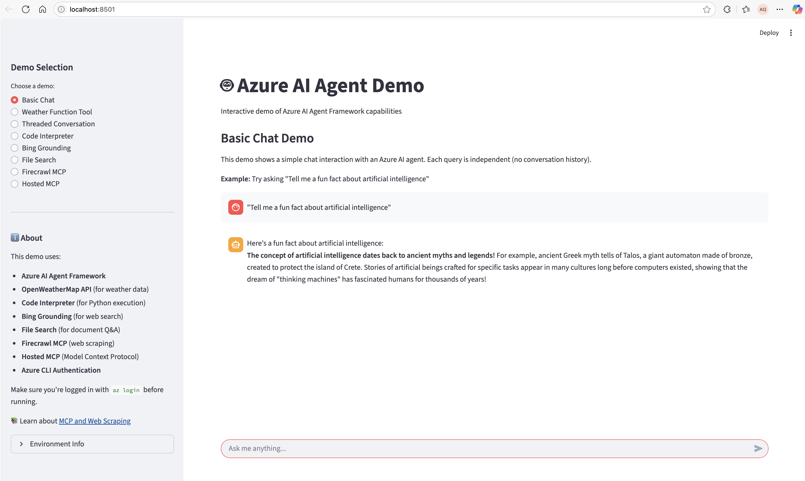
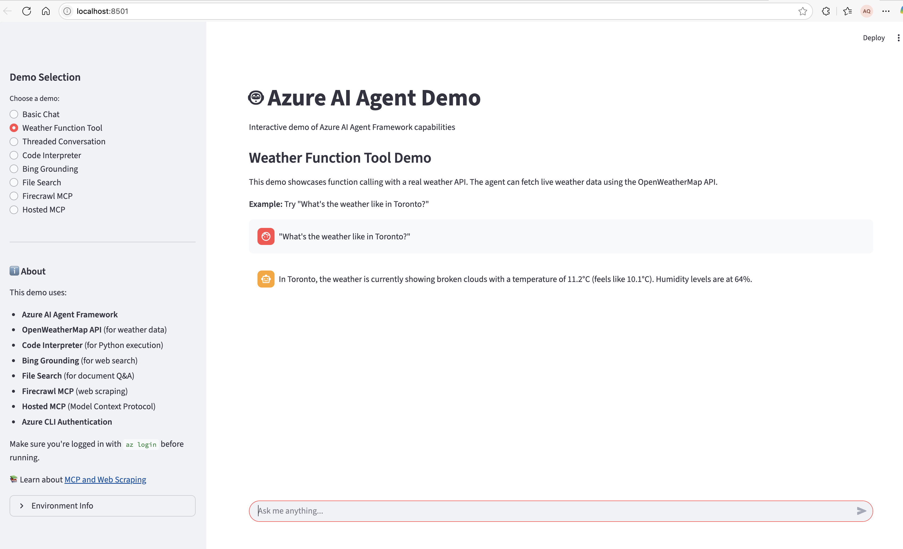
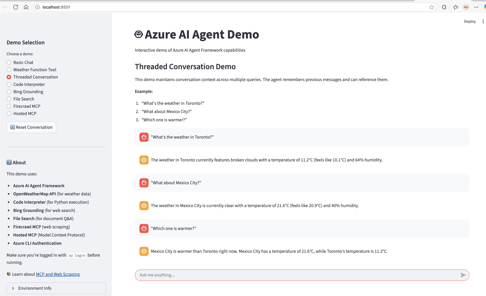
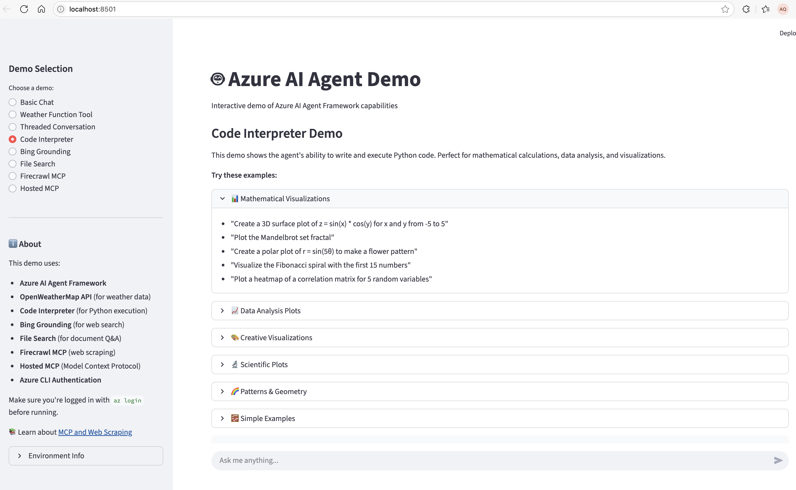
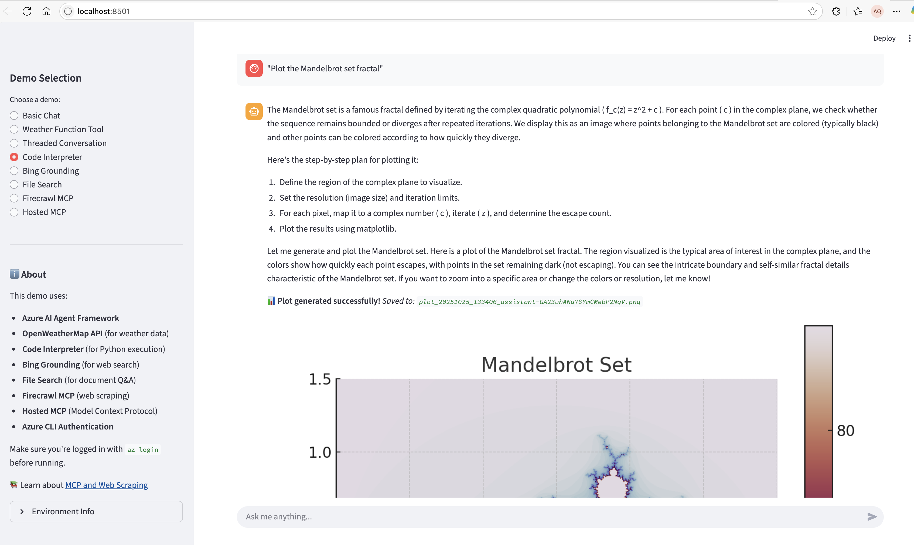

# Welcome to Microsoft Agent Framework!

> **📌 Note**: This is a **modified version** of the official [Microsoft Agent Framework repository](https://github.com/microsoft/agent-framework) with tailored code examples and demonstrations created by **Arturo Quiroga**, Sr. Partner Solutions Architect at Microsoft (EPS - Americas).
> 
> This repository includes custom implementations, interactive demos, and extended samples designed to showcase real-world agent scenarios and best practices.

[](https://discord.gg/b5zjErwbQM)
[](https://learn.microsoft.com/en-us/agent-framework/)
[](https://pypi.org/project/agent-framework/)
[](https://www.nuget.org/profiles/MicrosoftAgentFramework/)

Welcome to Microsoft's comprehensive multi-language framework for building, orchestrating, and deploying AI agents with support for both .NET and Python implementations. This framework provides everything from simple chat agents to complex multi-agent workflows with graph-based orchestration.

<p align="center">
  <a href="https://www.youtube.com/watch?v=AAgdMhftj8w" title="Watch the full Agent Framework introduction (30 min)">
    
  </a>
</p>
<p align="center">
  <a href="https://www.youtube.com/watch?v=AAgdMhftj8w">
    Watch the full Agent Framework introduction (30 min)
  </a>
</p>

## 📋 Getting Started

### 📦 Installation

Python

```bash
pip install agent-framework --pre
# This will install all sub-packages, see `python/packages` for individual packages.
# It may take a minute on first install on Windows.
```

.NET

```bash
dotnet add package Microsoft.Agents.AI
```

### 📚 Documentation

- **[Overview](https://learn.microsoft.com/agent-framework/overview/agent-framework-overview)** - High level overview of the framework
- **[Quick Start](https://learn.microsoft.com/agent-framework/tutorials/quick-start)** - Get started with a simple agent
- **[Tutorials](https://learn.microsoft.com/agent-framework/tutorials/overview)** - Step by step tutorials
- **[User Guide](https://learn.microsoft.com/en-us/agent-framework/user-guide/overview)** - In-depth user guide for building agents and workflows
- **[Migration from Semantic Kernel](https://learn.microsoft.com/en-us/agent-framework/migration-guide/from-semantic-kernel)** - Guide to migrate from Semantic Kernel
- **[Migration from AutoGen](https://learn.microsoft.com/en-us/agent-framework/migration-guide/from-autogen)** - Guide to migrate from AutoGen

### ✨ **Highlights**

- **Graph-based Workflows**: Connect agents and deterministic functions using data flows with streaming, checkpointing, human-in-the-loop, and time-travel capabilities
  - [Python workflows](./python/samples/getting_started/workflows/) | [.NET workflows](./dotnet/samples/GettingStarted/Workflows/)
- **AF Labs**: Experimental packages for cutting-edge features including benchmarking, reinforcement learning, and research initiatives
  - [Labs directory](./python/packages/lab/)
- **DevUI**: Interactive developer UI for agent development, testing, and debugging workflows
  - [DevUI package](./python/packages/devui/)

<p align="center">
  <a href="https://www.youtube.com/watch?v=mOAaGY4WPvc">
    
  </a>
</p>
<p align="center">
  <a href="https://www.youtube.com/watch?v=mOAaGY4WPvc">
    See the DevUI in action (1 min)
  </a>
</p>

- **Python and C#/.NET Support**: Full framework support for both Python and C#/.NET implementations with consistent APIs
  - [Python packages](./python/packages/) | [.NET source](./dotnet/src/)
- **Observability**: Built-in OpenTelemetry integration for distributed tracing, monitoring, and debugging
  - [Python observability](./python/samples/getting_started/observability/) | [.NET telemetry](./dotnet/samples/GettingStarted/AgentOpenTelemetry/)
- **Multiple Agent Provider Support**: Support for various LLM providers with more being added continuously
  - [Python examples](./python/samples/getting_started/agents/) | [.NET examples](./dotnet/samples/GettingStarted/AgentProviders/)
- **Middleware**: Flexible middleware system for request/response processing, exception handling, and custom pipelines
  - [Python middleware](./python/samples/getting_started/middleware/) | [.NET middleware](./dotnet/samples/GettingStarted/Agents/Agent_Step14_Middleware/)

### 💬 **We want your feedback!**

- For bugs, please file a [GitHub issue](https://github.com/microsoft/agent-framework/issues).

## Quickstart

### Basic Agent - Python

Create a simple Azure Responses Agent that writes a haiku about the Microsoft Agent Framework

```python
# pip install agent-framework --pre
# Use `az login` to authenticate with Azure CLI
import os
import asyncio
from agent_framework.azure import AzureOpenAIResponsesClient
from azure.identity import AzureCliCredential


async def main():
    # Initialize a chat agent with Azure OpenAI Responses
    # the endpoint, deployment name, and api version can be set via environment variables
    # or they can be passed in directly to the AzureOpenAIResponsesClient constructor
    agent = AzureOpenAIResponsesClient(
        # endpoint=os.environ["AZURE_OPENAI_ENDPOINT"],
        # deployment_name=os.environ["AZURE_OPENAI_RESPONSES_DEPLOYMENT_NAME"],
        # api_version=os.environ["AZURE_OPENAI_API_VERSION"],
        # api_key=os.environ["AZURE_OPENAI_API_KEY"],  # Optional if using AzureCliCredential
        credential=AzureCliCredential(), # Optional, if using api_key
    ).create_agent(
        name="HaikuBot",
        instructions="You are an upbeat assistant that writes beautifully.",
    )

    print(await agent.run("Write a haiku about Microsoft Agent Framework."))

if __name__ == "__main__":
    asyncio.run(main())
```

### Basic Agent - .NET

Create a simple Agent, using OpenAI Responses, that writes a haiku about the Microsoft Agent Framework

```c#
// dotnet add package Microsoft.Agents.AI.OpenAI --prerelease
using System;
using OpenAI;

// Replace the <apikey> with your OpenAI API key.
var agent = new OpenAIClient("<apikey>")
    .GetOpenAIResponseClient("gpt-4o-mini")
    .CreateAIAgent(name: "HaikuBot", instructions: "You are an upbeat assistant that writes beautifully.");

Console.WriteLine(await agent.RunAsync("Write a haiku about Microsoft Agent Framework."));
```

Create a simple Agent, using Azure OpenAI Responses with token based auth, that writes a haiku about the Microsoft Agent Framework

```c#
// dotnet add package Microsoft.Agents.AI.OpenAI --prerelease
// dotnet add package Azure.Identity
// Use `az login` to authenticate with Azure CLI
using System;
using OpenAI;

// Replace <resource> and gpt-4o-mini with your Azure OpenAI resource name and deployment name.
var agent = new OpenAIClient(
    new BearerTokenPolicy(new AzureCliCredential(), "https://ai.azure.com/.default"),
    new OpenAIClientOptions() { Endpoint = new Uri("https://<resource>.openai.azure.com/openai/v1") })
    .GetOpenAIResponseClient("gpt-4o-mini")
    .CreateAIAgent(name: "HaikuBot", instructions: "You are an upbeat assistant that writes beautifully.");

Console.WriteLine(await agent.RunAsync("Write a haiku about Microsoft Agent Framework."));
```

## 🎨 Interactive Streamlit Demo

Explore the Microsoft Agent Framework capabilities through our comprehensive **Streamlit Demo Application**. This interactive UI showcases **9 different agent scenarios** with real-world examples.

### 🚀 Quick Start

```bash
cd AQ-CODE
streamlit run streamlit_azure_ai_demo.py
```

The demo will open at `http://localhost:8501` and provides an intuitive interface to explore various agent capabilities.

### ✨ Demo Features

The Streamlit app demonstrates the following capabilities:

#### 1. **Basic Chat Agent**

*Screenshot: Basic chat interface showing conversational AI*

- Simple conversational AI interactions
- Real-time response streaming
- Token usage tracking (input/output/total)
- Clean markdown rendering

**Try asking:**
- "What is the Microsoft Agent Framework?"
- "Tell me about AI agents"
- "Explain how agents work"

---

#### 2. **Function Tools (Weather API)**

*Screenshot: Agent using weather API function tool*

- Demonstrates function/tool calling capabilities
- Integration with OpenWeatherMap API
- Real-time weather data retrieval
- Automatic function execution and response formatting

**Try asking:**
- "What's the weather in Seattle?"
- "Is it raining in London?"
- "Tell me the temperature in Tokyo"

---

#### 3. **Thread Management**

*Screenshot: Conversation thread persistence*

- Persistent conversation threads
- Context maintenance across multiple interactions
- Thread lifecycle management
- Demonstrates stateful agent conversations

**Try asking:**
- "My name is Alex" (then later) "What's my name?"
- "Remember that I like Python" (then later) "What programming language do I like?"
- Multi-turn contextual conversations

---

#### 4. **Code Interpreter**


*Screenshot: Python code execution and data visualization*

- Execute Python code dynamically
- Generate data visualizations (charts, plots, graphs)
- Mathematical computations and data analysis
- Automatic image generation and display

**Try asking:**
- "Create a bar chart showing sales data for Q1-Q4"
- "Calculate the fibonacci sequence and plot it"
- "Generate a scatter plot with random data"
- "Analyze this dataset: [1,2,3,4,5] and show statistics"

---

#### 5. **Bing Web Search (Grounding)**
<!--  -->
*Screenshot: Web search with citations*

- Real-time web search capabilities
- Grounded responses with source citations
- Integration with Bing Search API
- Numbered reference system for sources

**Try asking:**
- "What are the latest news about AI?"
- "Tell me about recent developments in quantum computing"
- "What happened in the tech industry this week?"

---

#### 6. **File Search (RAG)**
<!--  -->
*Screenshot: Document search and retrieval*

- Retrieval-Augmented Generation (RAG) with uploaded documents
- Multiple document support:
  - **employees.pdf**: Company employee directory
  - **product_catalog.txt**: Tech product specifications
  - **ai_research.pdf**: SigLIP research paper (2.1MB)
- Vector store creation and management
- Accurate document-grounded responses

**Try asking:**
- "Who is the CEO?" (employees.pdf)
- "What products do we have?" (product_catalog.txt)
- "What is SigLIP?" (ai_research.pdf)
- "Summarize the research paper" (ai_research.pdf)

---

#### 7. **Azure AI Search**
<!--  -->
*Screenshot: Hotel search with Azure AI Search*

- Search through indexed data using Azure AI Search
- Full-text and semantic search capabilities
- Integration with hotels-sample-index
- Accurate, grounded responses from indexed content

**Try asking:**
- "Search the hotel database for Stay-Kay City Hotel and give me detailed information"
- "Find luxury hotels with good ratings"
- "What hotels are available near the beach?"
- "Show me budget-friendly hotels"

**Setup:** Requires Azure AI Search connection in your Azure AI project with `hotels-sample-index` deployed.

---

#### 8. **Hosted MCP - Microsoft Learn**
<!--  -->
*Screenshot: Microsoft Learn documentation search via MCP*

- Model Context Protocol (MCP) integration
- Access to Microsoft Learn documentation
- Hosted MCP server connection
- Automatic function approval workflow
- Official Microsoft documentation grounding

**Try asking:**
- "How do I create an Azure Function?"
- "What is Azure AI Foundry?"
- "Explain Azure OpenAI Service"
- "Show me Azure deployment best practices"

**What is MCP?** See [MCP_EXPLAINED.md](./AQ-CODE/MCP_EXPLAINED.md) for detailed documentation on Hosted vs Local MCP.

---

#### 9. **Firecrawl MCP - Web Scraping**

---

#### 8. **Firecrawl MCP - Web Scraping**
<!--  -->
*Screenshot: Web scraping with Firecrawl*

- Advanced web scraping via MCP
- Clean markdown extraction from any website
- JavaScript rendering support
- Bot detection bypass
- Structured data extraction

**Try asking:**
- "Scrape https://news.ycombinator.com and summarize top stories"
- "Extract content from https://techcrunch.com about AI"
- "Get pricing from https://openai.com/pricing"
- "Summarize https://docs.python.org/3/"

**Setup:** Requires Firecrawl API key in `.env` file. Get one at [firecrawl.dev](https://firecrawl.dev)

---

### 📊 Common Features Across All Demos

Every demo mode includes:

- ✅ **Token Usage Display**: Real-time tracking of input, output, and total tokens
- ⏱️ **Execution Timing**: Performance metrics for each request
- 💬 **Chat History**: Full conversation context per demo mode
- 🎨 **Markdown Rendering**: Beautiful formatting for code, lists, and text
- 🔄 **Session State**: Independent chat histories for each demo
- 📱 **Responsive Design**: Clean, modern UI built with Streamlit
- 🛡️ **Error Handling**: Graceful error messages and recovery

### 🎯 Use Cases

This demo is perfect for:

- **Learning**: Understand different agent capabilities through hands-on examples
- **Prototyping**: Test agent behaviors before production implementation
- **Demonstrations**: Show stakeholders what agents can do
- **Development**: Quick experimentation with various agent patterns
- **Education**: Teaching AI agent concepts with visual feedback

### 🔧 Configuration

The demo uses environment variables from `.env` files:

```bash
# Required
AZURE_AI_PROJECT_ENDPOINT=your-endpoint
AZURE_AI_MODEL_DEPLOYMENT_NAME=gpt-4.1

# Optional (enables specific demos)
OPENWEATHER_API_KEY=your-key        # For weather demo
BING_CONNECTION_ID=your-id          # For Bing search demo
FIRECRAWL_API_KEY=your-key          # For Firecrawl MCP demo
# Azure AI Search connection is configured in Azure AI project
```

### 📁 Demo Files

- **Main Application**: `AQ-CODE/streamlit_azure_ai_demo.py` (1200+ lines)
- **MCP Documentation**: `AQ-CODE/MCP_EXPLAINED.md`
- **Sample Documents**: `AQ-CODE/sample_documents/`
- **Environment Config**: `python/samples/getting_started/.env`

### 🎬 Getting Started Video

<!-- Add video link when available -->
*Coming soon: Watch a walkthrough of all 9 demo scenarios*

---

## More Examples & Samples

### Python

- [Getting Started with Agents](./python/samples/getting_started/agents): basic agent creation and tool usage
- [Chat Client Examples](./python/samples/getting_started/chat_client): direct chat client usage patterns
- [Getting Started with Workflows](./python/samples/getting_started/workflows): basic workflow creation and integration with agents
- [**Interactive Streamlit Demo**](./AQ-CODE/streamlit_azure_ai_demo.py): comprehensive UI showcasing 9 agent scenarios

### .NET

- [Getting Started with Agents](./dotnet/samples/GettingStarted/Agents): basic agent creation and tool usage
- [Agent Provider Samples](./dotnet/samples/GettingStarted/AgentProviders): samples showing different agent providers
- [Workflow Samples](./dotnet/samples/GettingStarted/Workflows): advanced multi-agent patterns and workflow orchestration

## Contributor Resources

- [Contributing Guide](./CONTRIBUTING.md)
- [Python Development Guide](./python/DEV_SETUP.md)
- [Design Documents](./docs/design)
- [Architectural Decision Records](./docs/decisions)

## Important Notes

If you use the Microsoft Agent Framework to build applications that operate with third-party servers or agents, you do so at your own risk. We recommend reviewing all data being shared with third-party servers or agents and being cognizant of third-party practices for retention and location of data. It is your responsibility to manage whether your data will flow outside of your organization's Azure compliance and geographic boundaries and any related implications.
