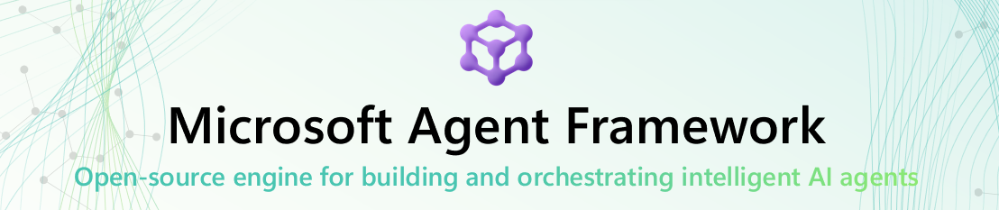

# Welcome to Microsoft Agent Framework!

> **📌 Note**: This is a **modified version** of the official [Microsoft Agent Framework repository](https://github.com/microsoft/agent-framework) with tailored code examples and demonstrations created by **Arturo Quiroga**, Sr. Partner Solutions Architect at Microsoft (EPS - Americas).
> 
> This repository includes custom implementations, interactive demos, and extended samples designed to showcase real-world agent scenarios and best practices.
>
> **🆕 Latest Updates (Oct 26, 2025)**: Conversation memory added to 4 scenarios, plot download button, Managed Identity authentication, and automated Azure deployment! See [CHANGELOG](./AQ-CODE/CHANGELOG.md) for details.

[](https://discord.gg/b5zjErwbQM)
[](https://learn.microsoft.com/en-us/agent-framework/)
[](https://pypi.org/project/agent-framework/)
[](https://www.nuget.org/profiles/MicrosoftAgentFramework/)

Welcome to Microsoft's comprehensive multi-language framework for building, orchestrating, and deploying AI agents with support for both .NET and Python implementations. This framework provides everything from simple chat agents to complex multi-agent workflows with graph-based orchestration.

<p align="center">
  <a href="https://www.youtube.com/watch?v=AAgdMhftj8w" title="Watch the full Agent Framework introduction (30 min)">
    
  </a>
</p>
<p align="center">
  <a href="https://www.youtube.com/watch?v=AAgdMhftj8w">
    Watch the full Agent Framework introduction (30 min)
  </a>
</p>

## 📋 Getting Started

### 📦 Installation

Python

```bash
pip install agent-framework --pre
# This will install all sub-packages, see `python/packages` for individual packages.
# It may take a minute on first install on Windows.
```

.NET

```bash
dotnet add package Microsoft.Agents.AI
```

### 📚 Documentation

- **[Overview](https://learn.microsoft.com/agent-framework/overview/agent-framework-overview)** - High level overview of the framework
- **[Quick Start](https://learn.microsoft.com/agent-framework/tutorials/quick-start)** - Get started with a simple agent
- **[Tutorials](https://learn.microsoft.com/agent-framework/tutorials/overview)** - Step by step tutorials
- **[User Guide](https://learn.microsoft.com/en-us/agent-framework/user-guide/overview)** - In-depth user guide for building agents and workflows
- **[Migration from Semantic Kernel](https://learn.microsoft.com/en-us/agent-framework/migration-guide/from-semantic-kernel)** - Guide to migrate from Semantic Kernel
- **[Migration from AutoGen](https://learn.microsoft.com/en-us/agent-framework/migration-guide/from-autogen)** - Guide to migrate from AutoGen

### ✨ **Highlights**

- **Graph-based Workflows**: Connect agents and deterministic functions using data flows with streaming, checkpointing, human-in-the-loop, and time-travel capabilities
  - [Python workflows](./python/samples/getting_started/workflows/) | [.NET workflows](./dotnet/samples/GettingStarted/Workflows/)
- **AF Labs**: Experimental packages for cutting-edge features including benchmarking, reinforcement learning, and research initiatives
  - [Labs directory](./python/packages/lab/)
- **DevUI**: Interactive developer UI for agent development, testing, and debugging workflows
  - [DevUI package](./python/packages/devui/)

<p align="center">
  <a href="https://www.youtube.com/watch?v=mOAaGY4WPvc">
    
  </a>
</p>
<p align="center">
  <a href="https://www.youtube.com/watch?v=mOAaGY4WPvc">
    See the DevUI in action (1 min)
  </a>
</p>

- **Python and C#/.NET Support**: Full framework support for both Python and C#/.NET implementations with consistent APIs
  - [Python packages](./python/packages/) | [.NET source](./dotnet/src/)
- **Observability**: Built-in OpenTelemetry integration for distributed tracing, monitoring, and debugging
  - [Python observability](./python/samples/getting_started/observability/) | [.NET telemetry](./dotnet/samples/GettingStarted/AgentOpenTelemetry/)
- **Multiple Agent Provider Support**: Support for various LLM providers with more being added continuously
  - [Python examples](./python/samples/getting_started/agents/) | [.NET examples](./dotnet/samples/GettingStarted/AgentProviders/)
- **Middleware**: Flexible middleware system for request/response processing, exception handling, and custom pipelines
  - [Python middleware](./python/samples/getting_started/middleware/) | [.NET middleware](./dotnet/samples/GettingStarted/Agents/Agent_Step14_Middleware/)

### 💬 **We want your feedback!**

- For bugs, please file a [GitHub issue](https://github.com/microsoft/agent-framework/issues).

## Quickstart

### Basic Agent - Python

Create a simple Azure Responses Agent that writes a haiku about the Microsoft Agent Framework

```python
# pip install agent-framework --pre
# Use `az login` to authenticate with Azure CLI
import os
import asyncio
from agent_framework.azure import AzureOpenAIResponsesClient
from azure.identity import AzureCliCredential


async def main():
    # Initialize a chat agent with Azure OpenAI Responses
    # the endpoint, deployment name, and api version can be set via environment variables
    # or they can be passed in directly to the AzureOpenAIResponsesClient constructor
    agent = AzureOpenAIResponsesClient(
        # endpoint=os.environ["AZURE_OPENAI_ENDPOINT"],
        # deployment_name=os.environ["AZURE_OPENAI_RESPONSES_DEPLOYMENT_NAME"],
        # api_version=os.environ["AZURE_OPENAI_API_VERSION"],
        # api_key=os.environ["AZURE_OPENAI_API_KEY"],  # Optional if using AzureCliCredential
        credential=AzureCliCredential(), # Optional, if using api_key
    ).create_agent(
        name="HaikuBot",
        instructions="You are an upbeat assistant that writes beautifully.",
    )

    print(await agent.run("Write a haiku about Microsoft Agent Framework."))

if __name__ == "__main__":
    asyncio.run(main())
```

### Basic Agent - .NET

Create a simple Agent, using OpenAI Responses, that writes a haiku about the Microsoft Agent Framework

```c#
// dotnet add package Microsoft.Agents.AI.OpenAI --prerelease
using System;
using OpenAI;

// Replace the <apikey> with your OpenAI API key.
var agent = new OpenAIClient("<apikey>")
    .GetOpenAIResponseClient("gpt-4o-mini")
    .CreateAIAgent(name: "HaikuBot", instructions: "You are an upbeat assistant that writes beautifully.");

Console.WriteLine(await agent.RunAsync("Write a haiku about Microsoft Agent Framework."));
```

Create a simple Agent, using Azure OpenAI Responses with token based auth, that writes a haiku about the Microsoft Agent Framework

```c#
// dotnet add package Microsoft.Agents.AI.OpenAI --prerelease
// dotnet add package Azure.Identity
// Use `az login` to authenticate with Azure CLI
using System;
using OpenAI;

// Replace <resource> and gpt-4o-mini with your Azure OpenAI resource name and deployment name.
var agent = new OpenAIClient(
    new BearerTokenPolicy(new AzureCliCredential(), "https://ai.azure.com/.default"),
    new OpenAIClientOptions() { Endpoint = new Uri("https://<resource>.openai.azure.com/openai/v1") })
    .GetOpenAIResponseClient("gpt-4o-mini")
    .CreateAIAgent(name: "HaikuBot", instructions: "You are an upbeat assistant that writes beautifully.");

Console.WriteLine(await agent.RunAsync("Write a haiku about Microsoft Agent Framework."));
```

## 🎨 Interactive Streamlit Demo

Explore the Microsoft Agent Framework capabilities through our comprehensive **Streamlit Demo Application**. This interactive UI showcases **9 different agent scenarios** with real-world examples.

### 🚀 Quick Start Options

**Local Development:**
```bash
cd AQ-CODE
streamlit run streamlit_azure_ai_demo.py
```
The demo will open at `http://localhost:8501`

**Docker Container:**
```bash
docker build -t agent-framework-demo -f AQ-CODE/Dockerfile .
docker run -p 8501:8501 \
  -e AZURE_AI_PROJECT_ENDPOINT=your-endpoint \
  -e AZURE_AI_MODEL_DEPLOYMENT_NAME=your-model \
  agent-framework-demo
```
Access at `http://localhost:8501`

**Azure Container Apps (Production):**
```bash
cd AQ-CODE
bash deploy-to-azure.sh
```
Automatically builds in ACR, deploys with Managed Identity authentication, and provides HTTPS endpoint.

> **🌐 Live Demo**: [https://agent-framework-demo.livelyforest-d40d7875.eastus.azurecontainerapps.io](https://agent-framework-demo.livelyforest-d40d7875.eastus.azurecontainerapps.io)
> 
> Deployed with DefaultAzureCredential + Managed Identity (no API keys in code!)

### ✨ Demo Features

The Streamlit app demonstrates the following capabilities:

#### 1. **Basic Chat Agent**

*Screenshot: Basic chat interface showing conversational AI*

- Simple conversational AI interactions
- Real-time response streaming
- Token usage tracking (input/output/total)
- Clean markdown rendering

**Try asking:**
- "What is the Microsoft Agent Framework?"
- "Tell me about AI agents"
- "Explain how agents work"

---

#### 2. **Function Tools (Weather API)**

*Screenshot: Agent using weather API function tool*

- Demonstrates function/tool calling capabilities
- Integration with OpenWeatherMap API
- Real-time weather data retrieval
- Automatic function execution and response formatting

**Try asking:**
- "What's the weather in Seattle?"
- "Is it raining in London?"
- "Tell me the temperature in Tokyo"

---

#### 3. **Thread Management**

*Screenshot: Conversation thread persistence*

- Persistent conversation threads
- Context maintenance across multiple interactions
- Thread lifecycle management
- Demonstrates stateful agent conversations
- **Built-in memory** that persists throughout the session

**Try asking:**
- "My name is Alex" (then later) "What's my name?"
- "Remember that I like Python" (then later) "What programming language do I like?"
- Multi-turn contextual conversations

**💬 Conversation Memory Feature:** Thread Management has built-in conversation persistence as part of the core framework functionality.

---

#### 4. **Code Interpreter**


*Screenshot: Python code execution and data visualization*

- Execute Python code dynamically
- Generate data visualizations (charts, plots, graphs)
- Mathematical computations and data analysis
- Automatic image generation and display
- **📥 Download Button**: Instantly download generated plots (PNG format)
  - Works locally and in Azure Container Apps
  - No external storage needed - direct in-browser downloads
  - Click "Download Plot" button after generation

**Try asking:**
- "Create a bar chart showing sales data for Q1-Q4"
- "Calculate the fibonacci sequence and plot it"
- "Generate a scatter plot with random data"
- "Analyze this dataset: [1,2,3,4,5] and show statistics"

**Tip:** After generating a plot, use the download button to save it to your device!

---

#### 5. **Bing Web Search (Grounding)**
<!--  -->
*Screenshot: Web search with citations*

- Real-time web search capabilities
- Grounded responses with source citations
- Integration with Bing Search API
- Numbered reference system for sources
- **💬 Conversation Memory**: Remembers previous searches and questions
  - Ask follow-up questions that reference earlier searches
  - "Tell me more about that" references previous results
  - Clear memory button to start fresh

**Try asking:**
- "What are the latest news about AI?"
- "Tell me about recent developments in quantum computing"
- Then: "Tell me more about that" ← references previous search
- "What happened in the tech industry this week?"

**Memory Example:**
1. "What are quantum computers?"
2. "Tell me more about that" ← maintains context
3. "Which companies are leading in this field?" ← continues thread

---

#### 6. **File Search (RAG)**
<!--  -->
*Screenshot: Document search and retrieval*

- Retrieval-Augmented Generation (RAG) with uploaded documents
- Multiple document support:
  - **employees.pdf**: Company employee directory
  - **product_catalog.txt**: Tech product specifications
  - **ai_research.pdf**: SigLIP research paper (2.1MB)
- Vector store creation and management
- Accurate document-grounded responses
- **💬 Conversation Memory**: Maintains context across questions about the same document
  - Ask follow-up questions without repeating document context
  - Continues understanding from previous answers
  - Clear memory button to reset conversation

**Try asking:**
- "Who is the CEO?" (employees.pdf)
- Then: "What's their experience level?" ← references previous answer
- "What products do we have?" (product_catalog.txt)
- "What is SigLIP?" (ai_research.pdf)
- Then: "Explain the methodology in more detail" ← maintains document context

**Memory Example (with employees.pdf):**
1. "Who works in sales?"
2. "What's the experience level of those employees?" ← remembers previous answer
3. "Who is the most senior?" ← continues context

---

#### 7. **Azure AI Search**
<!--  -->
*Screenshot: Hotel search with Azure AI Search*

- Search through indexed data using Azure AI Search
- Full-text and semantic search capabilities
- Integration with hotels-sample-index
- Accurate, grounded responses from indexed content
- **💬 Conversation Memory**: Remembers previous searches and context
  - Follow-up questions reference earlier results
  - Compare hotels across multiple queries
  - Clear memory button to start fresh

**Try asking:**
- "Search the hotel database for Stay-Kay City Hotel and give me detailed information"
- Then: "Tell me more about its amenities" ← references previous hotel
- "Find luxury hotels with good ratings"
- Then: "Which one is the cheapest?" ← compares previous results
- "What hotels are available near the beach?"

**Memory Example:**
1. "Find hotels in downtown"
2. "Which of those has a pool?" ← filters previous results
3. "What's the price for the first one?" ← references specific hotel from context

**Setup:** Requires Azure AI Search connection in your Azure AI project with `hotels-sample-index` deployed.

---

#### 8. **Hosted MCP - Microsoft Learn**
<!--  -->
*Screenshot: Microsoft Learn documentation search via MCP*

- Model Context Protocol (MCP) integration
- Access to Microsoft Learn documentation
- Hosted MCP server connection
- Automatic function approval workflow
- Official Microsoft documentation grounding

**Try asking:**
- "How do I create an Azure Function?"
- "What is Azure AI Foundry?"
- "Explain Azure OpenAI Service"
- "Show me Azure deployment best practices"

**What is MCP?** See [MCP_EXPLAINED.md](./AQ-CODE/MCP_EXPLAINED.md) for detailed documentation on Hosted vs Local MCP.

---

#### 9. **Firecrawl MCP - Web Scraping**

---

#### 8. **Firecrawl MCP - Web Scraping**
<!--  -->
*Screenshot: Web scraping with Firecrawl*

- Advanced web scraping via MCP
- Clean markdown extraction from any website
- JavaScript rendering support
- Bot detection bypass
- Structured data extraction

**Try asking:**
- "Scrape https://news.ycombinator.com and summarize top stories"
- "Extract content from https://techcrunch.com about AI"
- "Get pricing from https://openai.com/pricing"
- "Summarize https://docs.python.org/3/"

**Setup:** Requires Firecrawl API key in `.env` file. Get one at [firecrawl.dev](https://firecrawl.dev)

---

### 📊 Common Features Across All Demos

Every demo mode includes:

- ✅ **Token Usage Display**: Real-time tracking of input, output, and total tokens
- ⏱️ **Execution Timing**: Performance metrics for each request
- 💬 **Chat History**: Full conversation context per demo mode
- 🎨 **Markdown Rendering**: Beautiful formatting for code, lists, and text
- 🔄 **Session State**: Independent chat histories for each demo
- 📱 **Responsive Design**: Clean, modern UI built with Streamlit
- 🛡️ **Error Handling**: Graceful error messages and recovery

### 🆕 **Latest Enhancements**

#### **Conversation Memory (Thread Persistence)**
Implemented across multiple scenarios for contextual, multi-turn conversations:

- ✅ **Thread Management**: Built-in framework feature
- ✅ **Azure AI Search**: Search context maintained across questions
- ✅ **Bing Grounding**: Previous searches inform follow-up questions
- ✅ **File Search (RAG)**: Document context preserved throughout conversation

**How it works:**
- Each scenario tracks a `thread_id` in session state
- Threads are reused across messages for context continuity
- "Clear Conversation Memory" buttons reset threads
- Memory persists until explicitly cleared or session ends

**Example workflow:**
```
1. User: "What are quantum computers?" → Creates thread, stores context
2. User: "Tell me more about that" → Reuses thread, maintains context
3. User clicks "Clear Memory" → Resets thread, starts fresh
```

#### **Plot Download Button (Code Interpreter)**
Instant download capability for generated visualizations:

- 📥 One-click download of generated plots
- 🖼️ PNG format with proper naming
- ⚡ Works in both local and Azure Container Apps deployments
- 💾 No external storage needed - direct browser downloads
- 🎯 Automatic detection of latest plot

**How it works:**
- Code Interpreter saves plots to `/app/generated_plots/`
- App scans directory for latest PNG file
- Streamlit `download_button` provides instant download
- Works seamlessly with non-root Docker user permissions

#### **Azure Container Apps Deployment**
Production-ready containerized deployment with enterprise security:

- 🐳 **Multi-stage Docker build**: Optimized image size (~1.5GB)
- 🔐 **Managed Identity**: DefaultAzureCredential authentication (no API keys!)
- 🏗️ **Azure Container Registry**: Automated builds with timestamp tags
- 🚀 **One-command deployment**: `bash deploy-to-azure.sh`
- 🔒 **Security hardened**: Non-root user, minimal attack surface
- 📊 **Auto-scaling**: 1-3 replicas based on load
- 🌐 **HTTPS ingress**: Automatic SSL/TLS termination
- 📝 **Structured logging**: Full observability with Azure Monitor

**Deployment workflow:**
```bash
cd AQ-CODE
bash deploy-to-azure.sh
# → Builds in ACR with timestamp tag
# → Updates Container App with new image
# → App restarts with Managed Identity auth
# → Returns HTTPS URL in ~2 minutes
```

**Security benefits:**
- No API keys in environment variables or code
- Managed Identity assigned "Cognitive Services User" role
- Automatic credential rotation via Azure AD
- Compliant with enterprise security policies

### 🎯 Use Cases

This demo is perfect for:

- **Learning**: Understand different agent capabilities through hands-on examples
- **Prototyping**: Test agent behaviors before production implementation
- **Demonstrations**: Show stakeholders what agents can do
- **Development**: Quick experimentation with various agent patterns
- **Education**: Teaching AI agent concepts with visual feedback

### 🔧 Configuration

**Local Development (.env file):**
```bash
# Required
AZURE_AI_PROJECT_ENDPOINT=your-endpoint
AZURE_AI_MODEL_DEPLOYMENT_NAME=gpt-4.1

# Optional (enables specific demos)
OPENWEATHER_API_KEY=your-key        # For weather demo
BING_CONNECTION_ID=your-id          # For Bing search demo
FIRECRAWL_API_KEY=your-key          # For Firecrawl MCP demo
# Azure AI Search connection is configured in Azure AI project
```

**Azure Container Apps (Managed Identity):**
```bash
# No API keys needed! Uses DefaultAzureCredential
# Managed Identity automatically authenticates with:
# - Azure AI Foundry
# - Azure OpenAI
# - Azure AI Search
# - Other Azure services

# Setup:
# 1. Enable Managed Identity on Container App
# 2. Assign "Cognitive Services User" role
# 3. App authenticates automatically
```

### 📁 Demo Files

- **Main Application**: `AQ-CODE/streamlit_azure_ai_demo.py` (1273 lines)
- **Deployment Script**: `AQ-CODE/deploy-to-azure.sh` (217 lines)
- **Docker Configuration**: `AQ-CODE/Dockerfile` (multi-stage build)
- **Documentation**:
  - `AQ-CODE/CHANGELOG.md` - Complete version history and feature details
  - `AQ-CODE/DOCKER_README.md` - Docker and Azure Container Apps deployment guide
  - `AQ-CODE/MCP_EXPLAINED.md` - Model Context Protocol documentation
- **Sample Documents**: `AQ-CODE/sample_documents/`
  - `employees.pdf` - Employee directory
  - `product_catalog.txt` - Product specifications
  - `ai_research.pdf` - SigLIP research paper (2.1MB)
- **Environment Config**: `python/samples/getting_started/.env`

### 🎬 Getting Started Video

<!-- Add video link when available -->
*Coming soon: Watch a walkthrough of all 9 demo scenarios*

---

## More Examples & Samples

### Python

- [Getting Started with Agents](./python/samples/getting_started/agents): basic agent creation and tool usage
- [Chat Client Examples](./python/samples/getting_started/chat_client): direct chat client usage patterns
- [Getting Started with Workflows](./python/samples/getting_started/workflows): basic workflow creation and integration with agents
- [**Interactive Streamlit Demo**](./AQ-CODE/streamlit_azure_ai_demo.py): comprehensive UI showcasing 9 agent scenarios

### .NET

- [Getting Started with Agents](./dotnet/samples/GettingStarted/Agents): basic agent creation and tool usage
- [Agent Provider Samples](./dotnet/samples/GettingStarted/AgentProviders): samples showing different agent providers
- [Workflow Samples](./dotnet/samples/GettingStarted/Workflows): advanced multi-agent patterns and workflow orchestration

## Contributor Resources

- [Contributing Guide](./CONTRIBUTING.md)
- [Python Development Guide](./python/DEV_SETUP.md)
- [Design Documents](./docs/design)
- [Architectural Decision Records](./docs/decisions)

## Important Notes

If you use the Microsoft Agent Framework to build applications that operate with third-party servers or agents, you do so at your own risk. We recommend reviewing all data being shared with third-party servers or agents and being cognizant of third-party practices for retention and location of data. It is your responsibility to manage whether your data will flow outside of your organization's Azure compliance and geographic boundaries and any related implications.
