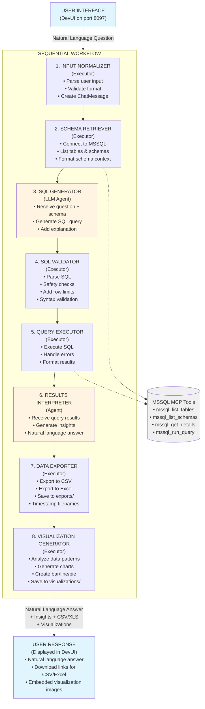
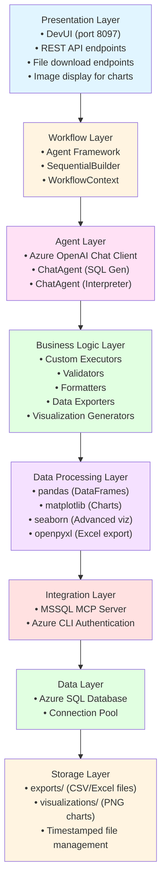
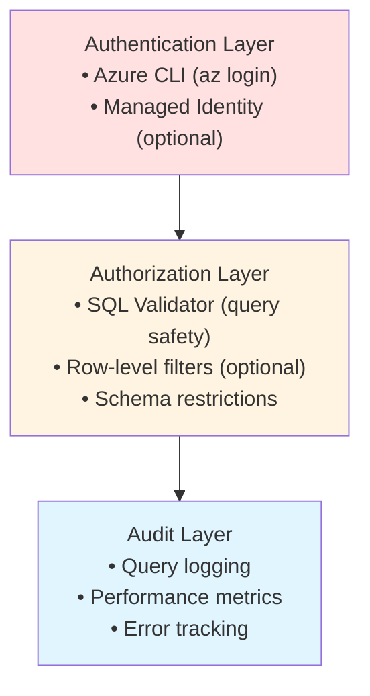
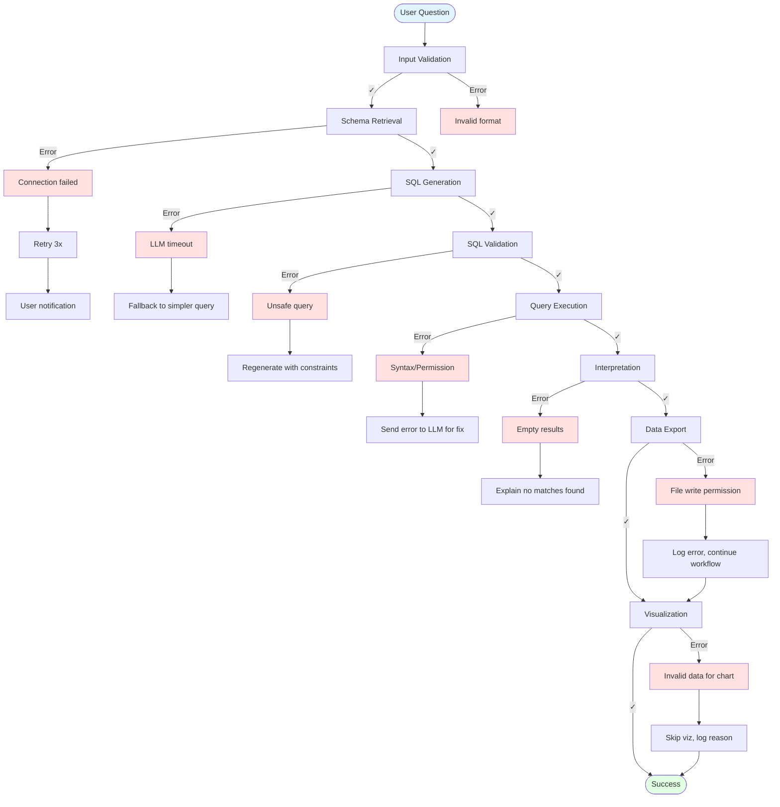

# NL2SQL Pipeline Architecture

## System Overview



## Data Flow

### 1. Input Phase
```
User Question (str)
    ↓
UserQuestion (Pydantic Model)
    ↓
ChatMessage(Role.USER, text=question)
```

### 2. Context Enrichment Phase
```
ChatMessage
    ↓
[MSSQL Connection]
    ↓
SchemaContext {
    tables: [...],
    schemas: [...],
    connection_id: "..."
}
    ↓
ChatMessage(Role.SYSTEM, text=schema_context + question)
```

### 3. SQL Generation Phase
```
ChatMessage (with schema)
    ↓
[Azure OpenAI LLM]
    ↓
ChatMessage(Role.ASSISTANT, text="```sql\nSELECT...\n```")
```

### 4. Validation Phase
```
ChatMessage (with SQL)
    ↓
SQL Extraction + Safety Checks
    ↓
ValidatedSQL {
    query: "SELECT...",
    is_safe: true,
    warnings: [...]
}
    ↓
ChatMessage(Role.SYSTEM, text=validated_sql)
```

### 5. Execution Phase
```
ChatMessage (with validated SQL)
    ↓
[MSSQL Database Execution]
    ↓
QueryResults {
    success: true,
    rows: [...],
    row_count: 42,
    columns: [...]
}
    ↓
ChatMessage(Role.SYSTEM, text=formatted_results)
```

### 6. Interpretation Phase
```
ChatMessage (with results)
    ↓
[Azure OpenAI LLM]
    ↓
ChatMessage(Role.ASSISTANT, text=natural_language_answer)
    ↓
[Continue to Export Phase]
```

### 7. Data Export Phase
```
QueryResults
    ↓
Data Export (CSV + Excel)
    ↓
ExportedFiles {
    csv_path: "exports/query_results_YYYYMMDD_HHMMSS.csv",
    excel_path: "exports/query_results_YYYYMMDD_HHMMSS.xlsx",
    row_count: 42
}
    ↓
[Continue to Visualization Phase]
```

### 8. Visualization Generation Phase
```
QueryResults + Column Metadata
    ↓
Chart Type Selection (based on data)
    ↓
Visualization Generation (matplotlib/seaborn)
    ↓
VisualizationOutput {
    chart_path: "visualizations/viz_YYYYMMDD_HHMMSS.png",
    chart_type: "bar",
    title: "..."
}
    ↓
[Workflow Output]
```

## Component Details

### Executors (Business Logic)

#### 1. InputNormalizerExecutor
- **Input**: `str` or `UserQuestion`
- **Output**: `ChatMessage`
- **Purpose**: Standardize input format
- **Key Logic**: Format question for LLM processing

#### 2. SchemaRetrieverExecutor
- **Input**: `ChatMessage`
- **Output**: `ChatMessage` (enriched with schema)
- **Purpose**: Provide database context
- **Key Logic**: 
  - Connect to MSSQL via MCP tools
  - Format schema for LLM understanding
  - Cache schema for performance

#### 3. SQLValidatorExecutor
- **Input**: `ChatMessage` (with SQL)
- **Output**: `ChatMessage` (validated SQL)
- **Purpose**: Security and safety
- **Key Logic**:
  - Regex-based SQL extraction
  - Keyword blacklist (DROP, DELETE, etc.)
  - Row limit enforcement
  - Syntax pre-check

#### 4. QueryExecutorExecutor
- **Input**: `ChatMessage` (validated SQL)
- **Output**: `ChatMessage` (query results)
- **Purpose**: Database interaction
- **Key Logic**:
  - Execute via mssql_run_query MCP tool
  - Error handling with context
  - Result formatting for LLM
  - Performance metrics

#### 5. DataExporterExecutor
- **Input**: `QueryResults`
- **Output**: `ExportedFiles` (CSV + Excel paths)
- **Purpose**: Persist query results for download/analysis
- **Key Logic**:
  - Export to CSV using pandas `to_csv()`
  - Export to Excel using pandas `to_excel()`
  - Timestamp-based filenames
  - Save to `exports/` directory
  - Handle large datasets (chunking if needed)
  - Preserve data types and formatting

#### 6. VisualizationGeneratorExecutor
- **Input**: `QueryResults` + Column metadata
- **Output**: `VisualizationOutput` (chart image path)
- **Purpose**: Automatic chart generation from query results
- **Key Logic**:
  - Analyze data characteristics (numeric, categorical, temporal)
  - Select appropriate chart type:
    - Bar charts for categorical comparisons
    - Line charts for time series
    - Pie charts for proportions
    - Scatter plots for correlations
  - Generate using matplotlib/seaborn
  - Save to `visualizations/` directory
  - Create descriptive titles and labels
  - Handle edge cases (empty data, single value, etc.)

### Agents (LLM-Powered)

#### 1. SQL Generator Agent
- **Model**: Azure OpenAI (GPT-4)
- **Input**: User question + Database schema
- **Output**: SQL query + explanation
- **Instructions**: 
  - Generate SELECT statements
  - Use proper JOIN syntax
  - Add TOP clauses
  - Include comments
  - Provide explanations

#### 2. Results Interpreter Agent
- **Model**: Azure OpenAI (GPT-4)
- **Input**: Query results + original question
- **Output**: Natural language answer + insights
- **Instructions**:
  - Answer user's question directly
  - Extract key insights
  - Identify patterns
  - Suggest follow-ups

## Technology Stack



## Security Architecture



## Observability Architecture

```
┌──────────────────────────────────────┐
│   Tracing Layer                      │
│   • OpenTelemetry SDK               │
│   • OTLP Exporter                   │
│   • Console Exporter (dev)          │
└────────────┬─────────────────────────┘
             │
             ├─────────────────────────┐
             │                         │
┌────────────▼──────────┐  ┌──────────▼──────────┐
│  Application Insights │  │  OTLP Receiver      │
│  • Distributed traces │  │  • Jaeger           │
│  • Metrics           │  │  • Zipkin           │
│  • Logs              │  │  • Custom backend   │
└──────────────────────┘  └─────────────────────┘
```

## Deployment Architecture

### Development
```
┌─────────────────────┐
│  Local Machine      │
│  • Python 3.10+    │
│  • .venv           │
│  • DevUI (8097)    │
└──────────┬──────────┘
           │
           ├──────────────────┐
           │                  │
┌──────────▼──────┐  ┌────────▼──────────┐
│  Azure OpenAI   │  │  Azure SQL DB     │
│  • GPT-4        │  │  • Dev Database   │
└─────────────────┘  └───────────────────┘
```

### Production
```
┌────────────────────────────────┐
│  Azure Container Instance      │
│  • Workflow Container         │
│  • Auto-scaling              │
│  • Health checks             │
└───────────┬────────────────────┘
            │
            ├─────────────────────────┐
            │                         │
┌───────────▼──────┐    ┌────────────▼─────────┐
│  Azure OpenAI    │    │  Azure SQL DB        │
│  • Private EP   │    │  • Production        │
│  • VNet         │    │  • Geo-replicated    │
└─────────────────┘    └──────────────────────┘
            │
┌───────────▼──────────────────┐
│  Application Insights        │
│  • Monitoring               │
│  • Alerts                   │
└─────────────────────────────┘
```

## Error Handling Flow



## Performance Characteristics

| Component | Avg Latency | Notes |
|-----------|-------------|-------|
| Input Normalizer | <10ms | Pure Python |
| Schema Retriever | 50-200ms | DB round-trip |
| SQL Generator | 1-3s | LLM inference |
| SQL Validator | <50ms | Regex + rules |
| Query Executor | 100ms-5s | Depends on query |
| Results Interpreter | 1-2s | LLM inference |
| Data Exporter | 50-500ms | File I/O + pandas |
| Visualization Generator | 200ms-2s | Chart rendering |
| **Total Pipeline** | **4-14s** | Typical question |

## Scaling Considerations

### Bottlenecks
1. **LLM Latency** (2-5s per call)
   - Solution: Use streaming responses
   - Cache common queries

2. **Database Connections** (limited pool)
   - Solution: Connection pooling
   - Async query execution

3. **Schema Retrieval** (repeated fetches)
   - Solution: Cache schema for 5-10 minutes
   - Background refresh

### Optimization Strategies
1. Parallel schema + table fetch
2. LLM response streaming
3. Result pagination
4. Query result caching
5. Schema information caching
6. Async file exports (CSV/Excel in parallel)
7. Lazy visualization generation (on-demand)
8. Reuse visualizations for identical queries
9. Compress/archive old exports periodically
10. Thumbnail generation for quick preview
